# `tax_optimizer` — module architecture

A reference for **what each module does, how the modules fit together,
and where to look** when you need to understand or extend a particular
piece of the simulator. Use this alongside [`scenario_guide.md`](scenario_guide.md)
(JSON / Inputs surface) and [`market_models.md`](market_models.md) (return
generators).

This document tracks the source as of v6.6 (mega-backdoor auto-spillover
+ §125 cafeteria-plan premiums). Newer changes will be linked from
`CHANGELOG.md` if the architecture shifts materially.

---

## 1. Bird's-eye view

The package is built in **four functional layers**:

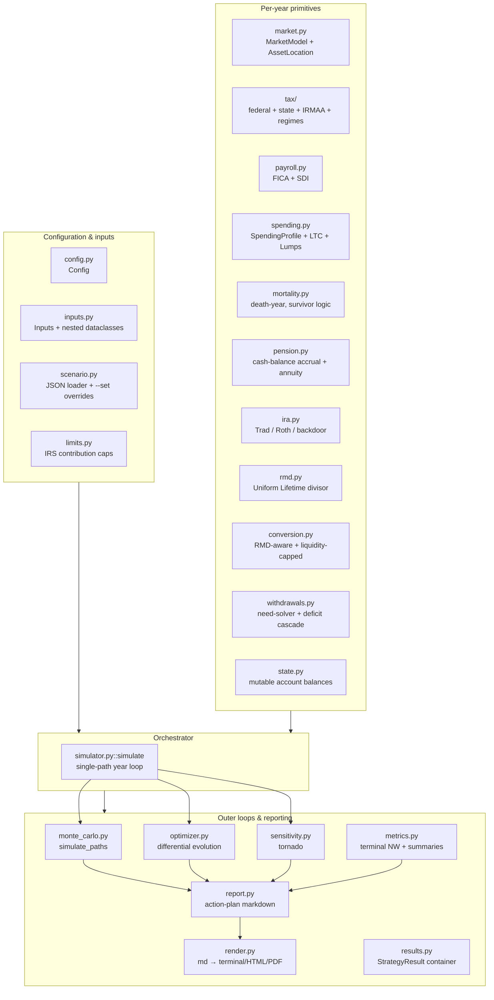

**Read top-to-bottom**: the configuration layer feeds the engine
primitives, which feed the single-path simulator, which feeds the outer
loops (Monte Carlo, optimizer, sensitivity) and the report builder.
The simulator is the only piece that "knows the year loop"; every other
module is either a configuration input, a stateless primitive, or a
consumer of `simulate()` output.

---

## 2. Public entry points

Most users touch exactly four things:

| Entry point | When to use it | Returns |
|---|---|---|
| `tax_optimizer.simulate(cfg, inputs)` | Single deterministic path, useful for sanity checks and notebooks | `pandas.DataFrame` with one row per year |
| `tax_optimizer.simulate_paths(cfg, inputs, n_paths=...)` | Stochastic multi-path Monte Carlo | `MonteCarloResult` with summary() / percentiles |
| `tax_optimizer.optimize_household(cfg, inputs, ...)` | Find best Tier B/C lever settings | `dict[str, StrategyResult]` (S0/S1/S2/S3) |
| `python -m tax_optimizer --scenario file.json` | CLI: load + simulate + report end-to-end | Stdout markdown + optional HTML/PDF artifacts |

Everything else is a building block called by these four.

---

## 3. Configuration layer

These modules describe the **inputs**: scenario semantics, knob shapes,
defaults, and how user-supplied JSON gets parsed and validated.

### `tax_optimizer/config.py` — `Config`

The **simulation-wide knobs** that aren't household-specific. Two
broad categories:

- **Macro assumptions** — `inflation`, `wage_growth`, `taxable_drag`,
  `nominal_growth_rate` (fallback when no `market` block is set)
- **Strategy / policy choices** — `withdrawal_strategy`,
  `bracket_fill_target`, `roth_conversion_target_bracket`,
  `roth_conversion_amount`, `cap_conversion_by_liquidity`,
  `protect_roth_in_conversion_years`,
  `conversion_taxable_use_ratio`, `section125_reduces_fica_wages`,
  `rmd_start_age`, `aca_enabled`, `stepup_at_first_death`,
  `optimize_ss_claim_age`, etc.

Also bundles three pluggable sub-objects:

- `mortality: Mortality` — when each spouse dies and survivor benefit handling
- `market: MarketModel | None` — the return generator (see `market.py`)
- `spending: SpendingProfile | None` — base + smile + LTC + lumps
- `asset_location: AssetLocation` — per-bucket equity/bond split

`Config` is a frozen `dataclass`. Mutation goes through `dataclasses.replace`
or the scenario-overrides mechanism in `scenario.py`.

### `tax_optimizer/inputs.py` — `Inputs`

The **household-specific data**: spouse ages, retire ages, salaries,
contribution percentages, Roth-401(k) splits, employer-match terms,
starting balances, Social Security claim ages, pension cash-balance
inputs, and (v6.6) §125 health-insurance premiums.

Six nested dataclasses live on `Inputs`:

| Nested block | Purpose |
|---|---|
| `StartingBalances` | Year-0 account balances per bucket |
| `CurrentIncome` | Salaries / bonuses / interest / div / cap-gains |
| `CurrentContrib` | HSA family contribution target |
| `PensionInputs` | Cash-balance starting balance + NRD inputs |
| `SocialSecurity` | Per-spouse claim age + monthly benefit |
| `HealthPremiums` | Medical / dental / vision per spouse (v6.6) |

The deprecated `Inputs.annual_expenses` field is preserved for legacy
scenario JSON but no longer drives the simulator; spending now lives on
`cfg.spending`.

### `tax_optimizer/scenario.py` — JSON loader + `--set` overrides

Parses a scenario JSON, validates every key against the dataclass
fields (typos raise `ScenarioError` with a targeted hint), coerces
polymorphic blocks (`market`, `spending`, `state_regime`,
`tax_regime`), and applies any `--set DOTTED.PATH=VALUE` overrides
from the CLI.

Three knobs of note in the legacy-migration path:

- `spouse_*_retire_age` used to live on `Config`; now on `Inputs` (legacy
  hint emitted with the new field path)
- `ss_start_age` / `pension_start_age` used to live on `Config`; now on
  `inputs.ss.start_age` / `inputs.pension.start_age` (same legacy hint)

A round-trip helper `scenario_to_dict(cfg, inputs)` reverses the parse
— used by `--print-defaults`.

### `tax_optimizer/limits.py` — IRS contribution caps

Plain constants + small helper functions:

- `ELECTIVE_DEFERRAL_LIMIT = 23_500` (§402(g) 2026 nominal)
- `ELECTIVE_DEFERRAL_CATCH_UP_50 = 7_500`
- `SECTION_415C_LIMIT = 70_000` (overall annual additions cap)
- `IRA_CONTRIBUTION_LIMIT = 7_500` (+ catch-up)
- `HSA_FAMILY_LIMIT = 8_550` + `HSA_FAMILY_CATCH_UP_55 = 1_000` per spouse
- `OASDI_WAGE_BASE_2026 = 176_100` (also referenced from `payroll.py`)

Helpers: `elective_deferral_cap(age)`, `hsa_family_cap(age_a, age_b, either_working)`,
`ira_contribution_limit(age)`. Catch-up is **excluded** from §415(c)
per IRS — used by the mega-backdoor room calc in `simulator.py`.

---

## 4. Per-year engine primitives

These modules implement stateless or near-stateless **building blocks**.
The simulator picks them up and assembles them in the right order each
year.

### `tax_optimizer/tax/` — federal + state + IRMAA + regimes

The tax engine. Four submodules:

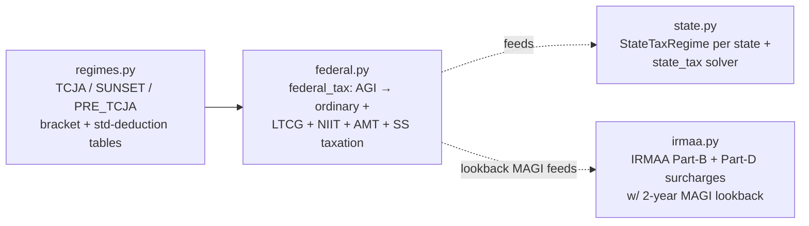

**`tax/regimes.py`** packages the bracket + threshold + standard-deduction
tables for each filing status. Five named regimes:

- `TCJA_EXTENDED` (default through 2025, extended) — 10/12/22/24/32/35/37
- `SUNSET_2026` (TCJA expiry) — 10/15/25/28/33/35/39.6
- `PRE_TCJA_2017` (historical sanity check)
- `STATELESS_RAW` (federal only — never used directly, used as base for state)

The regime swap is driven by `cfg.regime_change_year_offset` +
`cfg.regime_change_target` — useful for stress-testing the TCJA sunset.

**`tax/federal.py::federal_tax(...)`** is the per-year federal tax
solver. It composes:

1. Provisional-income calc → portion of SS taxable (via
   `social_security_taxable`)
2. Ordinary income tax on `taxable_income = AGI − std_deduction`
3. LTCG / QDIV tax stacked above the ordinary base
4. NIIT 3.8% on the lesser of net-investment-income vs. MAGI excess
5. AMT (TMT) using the regime's exemption table
6. Final tax = `max(AMT, regular_tax_with_LTCG)`

Helper `amount_to_fill_bracket(filing, agi, target_bracket, regime, year_offset)`
gives the dollars between the current marginal rate and a target
bracket ceiling — drives the **bracket-fill Roth conversion sizing**
in `conversion.py`.

**`tax/state.py::StateTaxRegime`** is per-state and bundles ordinary
brackets, std-deduction, dependent treatment of LTCG (some conform,
some don't), and SDI rate + wage cap. Five regimes ship in-box:
`CA`, `NY`, `IL`, `MA`, `STATELESS`. The simulator looks up via
`cfg.state_regime` (string label like `"CA"` accepted at JSON parse).

`state_tax(regime, filing_status, wages_box1, ...)` returns a
state-tax dict. Same regime-swap mechanism as federal:
`cfg.state_regime_change_year_offset` + `cfg.state_regime_change_target`.

**`tax/irmaa.py::lookup(magi, year, filing_status)`** returns a dict
with `tier`, `total_yearly`, etc. The simulator passes the **2-year
lookback MAGI** (per SSA rules) via `cfg.irmaa_lookback_years`. The
brackets inflate at `cfg.inflation` to keep real IRMAA roughly
constant.

### `tax_optimizer/payroll.py` — FICA + state SDI

`fica_employee(wages, ...)` and `fica_household(wages_a, wages_b, ...)`
compute OASDI + base Medicare + Additional Medicare. The household
variant reconciles Form-8959 (the 0.9% Additional Medicare surcharge
applies at the **household** MFJ threshold of $250k combined wages,
not $200k per W-2).

`state_sdi(wages, rate, wage_cap)` is the per-spouse state-disability
withholding (e.g. CA SDI at 1.1% uncapped since SB 951 in 2024).

v6.6: when `cfg.section125_reduces_fica_wages = True` (default), the
simulator passes the **post-§125** wages (gross − HSA − M/D/V) to
both `fica_household` and `state_sdi`. Pre-v6.6 the package
approximated FICA on gross wages (documented in `payroll.py`'s
header docstring).

### `tax_optimizer/market.py` — `MarketModel` + asset location

Four `MarketModel` implementations satisfy the same protocol:

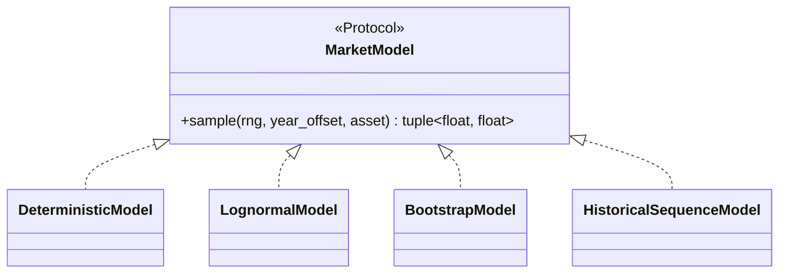

| Model | Use case | Distinguishing knob |
|---|---|---|
| `DeterministicModel(equity, bond)` | Sanity checks, back-compat with scalar growth | Constant returns |
| `LognormalModel(eq_mu, eq_sigma, bond_mu, bond_sigma, equity_bond_corr, cape_today, cape_long_run)` | Default for Monte Carlo | Optional CAPE-mean reversion + cross-asset correlation |
| `BootstrapModel(history_csv)` | Empirical resampling | Block-bootstrap or i.i.d. annual draws |
| `HistoricalSequenceModel(history_csv, start_year)` | Sequence-of-returns stress test (e.g. "what if 1966 happens again") | Replays a contiguous historical slice |

`AssetMix(equity_pct, label)` and `AssetLocation(pretax, roth, taxable, hsa)`
give per-bucket equity weights so the simulator can compute returns
per bucket each year. `AssetLocation.uniform(equity_pct)` is the
convenience constructor used by the JSON `"uniform_equity_pct"` form.

`CMA_PRESETS` is a dict of named capital-market-assumption bundles
(Vanguard 10y, Research Affiliates, BlackRock 30y, etc.) →
convenience builder `lognormal_from_cma(name, **overrides)`.

See [`docs/market_models.md`](market_models.md) for the deep dive on
all four models and CMA selection.

### `tax_optimizer/spending.py` — `SpendingProfile`

The retirement-spending model. Two `kind`s, plus `LumpEvent` and
`LongTermCareShock`:

- `SpendingProfile.flat(base_spending)` — flat real spending,
  CPI-grown only
- `SpendingProfile.smile(base_spending, ltc_years, ltc_annual_today, ...)`
  — Blanchett/Bernicke "go-go / slow-go / no-go" curve with an LTC
  shock attached at the end (default last 3 years)

Both produce per-year `nominal_need(year_offset)` floats. Lumps
(`LumpEvent`) are one-time bumps in a specific year (vacation,
new roof, college tuition shortfall). The simulator pulls all of
these together in the working-year loop.

### `tax_optimizer/mortality.py` — death year + survivor logic

`Mortality(year_of_death_a, year_of_death_b, pension_survivor_pct, ss_survivor_keeps_higher)`.

When one spouse dies in year `y`:

- Filing status switches `mfj → single` from year `y+1` onward
- The survivor inherits the deceased's pretax + Roth balances (modeled
  as a single account — the survivor's account now holds combined
  balances). Inherited-IRA 10-year rule is NOT modeled (known limit).
- Pension annuity survives at `pension_survivor_pct` (e.g. 0.5 for J&S 50%)
- Social Security survivor benefit: if `ss_survivor_keeps_higher = True`,
  the survivor keeps the larger of the two benefits

`death_year_for_path(rng)` gives stochastic-mortality support for Monte
Carlo (drawn from a SSA-derived distribution).

### `tax_optimizer/pension.py` — cash-balance projection

Calibrated to the **BP Retirement Accumulation Plan (RAP)**:

- `project_pension_balance(starting, gross, years_to_nrd, wage_growth, ...)`
  rolls forward the cash-balance from today to spouse-A's NRD using
  tiered pay credits + interest credits (pre-2016 floor of 4.5% for
  legacy participants, otherwise IRC §417(e) segment rates)
- `pension_annual_credit(eligible_earnings, years_of_service, ...)`
  is the per-year credit amount (used in the working-year loop to
  grow the balance)
- `pension_annuity_at_nrd(balance, ...)` converts the cash balance
  to a J&S annuity using IRS §417(e) factors

Knobs come from `inputs.pension`: `balance_today`, `monthly_at_nrd`,
`start_age`, `years_of_service_today`, `pre_2016_participant`,
`interest_rate`, `irs_comp_limit_today`.

### `tax_optimizer/ira.py` — Traditional / Roth / backdoor

Per-spouse helper bundle. Each spouse can split their annual IRA
contribution across three paths, sharing one cap:

- `traditional_ira_contribution` (deductible Trad)
- `roth_ira_contribution` (direct, MAGI-phased-out)
- `backdoor_roth` (non-deductible Trad → same-day conversion)

`size_ira_contributions(...)` returns a `IRAContribResult` dataclass
with each path sized for the cap, the MAGI phase-out for direct Roth,
and the pro-rata adjustment for backdoor (only the IRA-only sub-balance
counts; 401(k) doesn't pro-rata with IRA).

### `tax_optimizer/rmd.py` — Required Minimum Distribution

`rmd_amount(balance, age, rmd_start_age)` returns the year's RMD
using the IRS Uniform Lifetime divisor table (ages 72–110 baked in).
RMDs are **per-spouse on their own pretax** — surfaced as separate
`a_rmd` and `b_rmd` in the simulator so the household's combined RMD
isn't computed on a fictional joint balance.

The simulator eats RMD-occupied bracket room before sizing the Roth
conversion (RMD-aware conversion logic in `conversion.py`).

### `tax_optimizer/conversion.py` — `planned_roth_conversion`

Two sizing modes (one chosen per scenario):

1. **Fixed-amount** (`cfg.roth_conversion_amount > 0`) — convert
   exactly that many dollars
2. **Bracket-fill** (`cfg.roth_conversion_target_bracket > 0`) — fill
   the target bracket exactly (using `amount_to_fill_bracket` from
   `tax/federal.py`)

v6.5 added a **liquidity guard** layered on top of either mode. The
sizer now bisects on `convert_amount` to find the largest amount
whose marginal federal+state tax stays within the household's
`tax_paying_capacity` (passed in by `simulator.py`). Returns a
`ConversionPlan(conv_a, conv_b, capped_by_liquidity, bracket_target_total)`
NamedTuple.

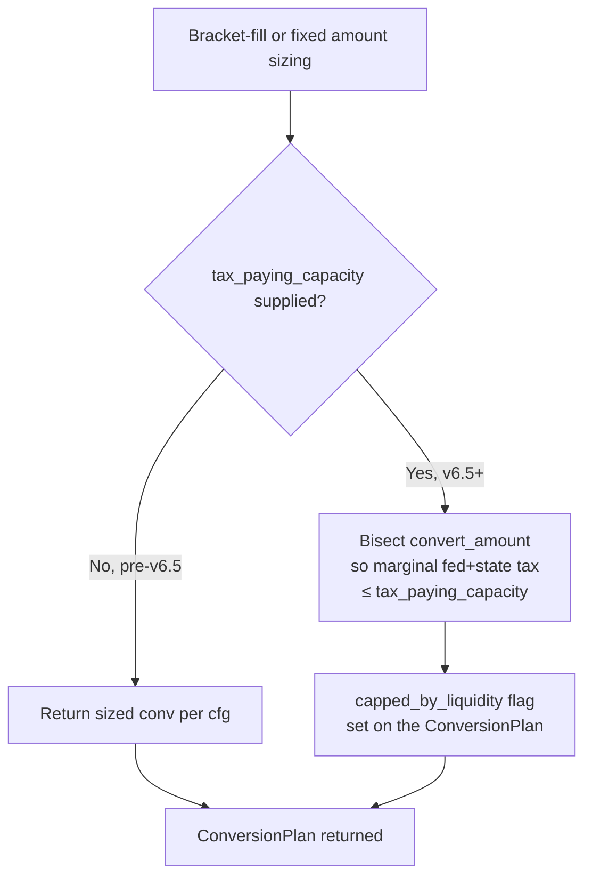

`simulator.py` then converts on the spouse-A pretax first, spouse-B
pretax second (canonical ordering; revisitable as a future per-spouse
optimization axis).

### `tax_optimizer/withdrawals.py` — need-solver + deficit cascade

Two entry points:

- `withdraw_for_need(net_need, state, ...)` — for the "conventional"
  withdrawal strategy, solves jointly for taxable / pretax / Roth /
  HSA withdrawals that **net** to the target spending. Includes
  iterative federal/state tax solver because pretax withdrawals
  generate tax.
- `cover_deficit(deficit, state, ...)` — used when the household's
  cash inflow falls short. Cascades through buckets in order:

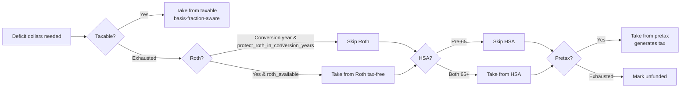

The cascade respects:

- **Capital-gains basis fraction** on taxable withdrawals
  (`cfg.cap_gains_basis_fraction`, live-tracked basis via `state.basis_fraction`)
- **Roth 5-year clock** — not modeled, but v6.5
  `protect_roth_in_conversion_years` excludes Roth from the cascade
  in any year a conversion fires (prevents silent Roth-raid to pay
  conversion tax)
- **HSA pre-65 penalty** — HSA only enters the cascade once both
  spouses are 65+ (or the older spouse is 65+ and the younger is
  retired)
- **Pretax tax-on-withdrawal** — iteratively solves federal+state
  marginal so the *gross* withdrawal is sized to land at the target
  *net*

Unfunded dollars surface in the `unfunded` column of the simulation
DataFrame — the closest proxy this package has to "this plan fails
in year N".

### `tax_optimizer/state.py` — `State`

Tiny dataclass holding the mutable per-year account balances:

```python
@dataclass
class State:
    spouse_a_pretax: float
    spouse_b_pretax: float
    roth: float
    taxable: float
    hsa: float
    pension_balance: float
    pension_annuity: float
    cumulative_basis: float
    prior_agi: float          # for IRA MAGI lookback
    prior_magi: float         # for IRMAA 2-year lookback
    year: int
```

Pass-by-mutation through the year loop. `state.py` is intentionally
boring — it's the single mutable cell that ties together all the
otherwise-stateless engine primitives.

---

## 5. The orchestrator — `tax_optimizer/simulator.py`

This is **where the year loop lives**. ~1,300 lines, single function
`simulate(cfg, inputs, *, rng=None) -> pandas.DataFrame`. Per year:

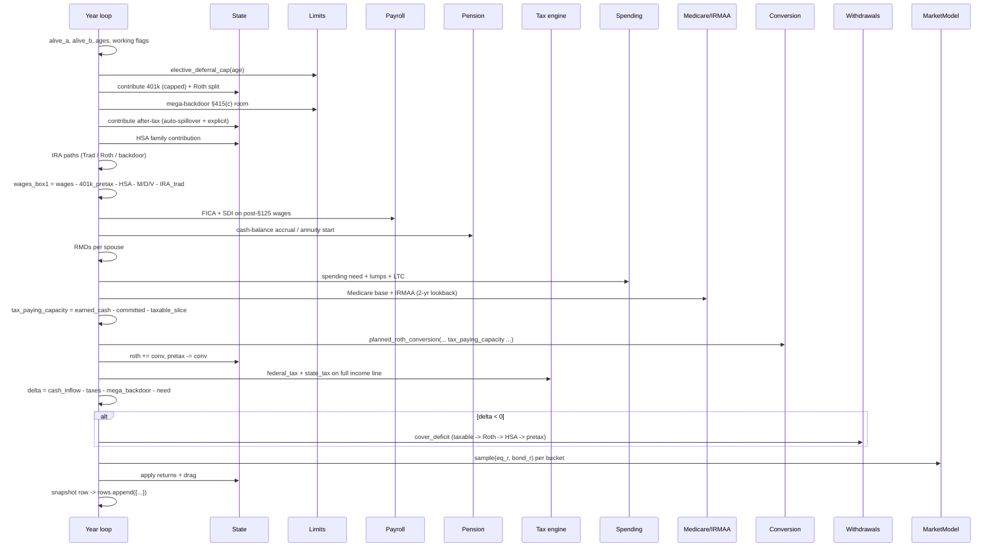

### Why so much hoisting

The simulator pre-computes a lot of "downstream" obligations early
(spending need, healthcare, HSA pay-down, base tax) so that
**`tax_paying_capacity`** is accurate when passed to
`planned_roth_conversion`. Without that, the conversion sizer would
fill the bracket without knowing whether the household has cash to
pay the resulting tax — leading to silent Roth-raids (the v6.5 bug).

The order is fragile but well-tested; the docstrings inline mark the
v6.5 hoisting points explicitly.

### What ends up in the DataFrame

One row per simulated year, with columns roughly grouped:

- **Identity**: `year`, `spouse_a_age`, `spouse_b_age`, `filing_status`
- **Income**: `wages`, `pension`, `ssn`, `interest_income`,
  `qualified_dividends`, `ordinary_dividends`
- **Contributions**: `elective_deferral_a/b`, `employer_match_a/b`,
  `mega_backdoor_a/b`, `mega_backdoor_spillover_a/b` (v6.6),
  `excess_deferral_a/b` (v6.6), `after_tax_target_uncovered_a/b` (v6.6),
  `hsa_contrib`, `ira_traditional_a/b`, `ira_roth_direct_a/b`,
  `ira_backdoor_a/b`
- **Roth conversion**: `roth_conversion`,
  `roth_conv_capped_by_liquidity`, `roth_conv_bracket_target`,
  `roth_conv_tax_capacity` (all v6.5)
- **RMD**: `rmd`
- **Withdrawals**: `pretax_withdrawal`, `roth_withdrawal`,
  `taxable_withdrawal`, `hsa_withdrawal`
- **Tax**: `agi`, `federal_tax`, `state_tax`, `marginal`, `niit`,
  `amt_addon`, `ss_taxable`, `fica`, `state_sdi`
- **§125 health premiums (v6.6)**: `health_premium_a/b`,
  `health_premium_total`
- **Healthcare**: `irmaa`, `irmaa_tier`, `irmaa_lookback_agi`,
  `medicare_base_premium`, `health_pre65`, `aca_benchmark_premium`,
  `aca_apt_credit`
- **End-of-year balances**: `pretax_balance`, `pretax_a_balance`,
  `pretax_b_balance`, `roth_balance`, `taxable_balance`,
  `hsa_balance`, `pension_balance`, `cumulative_basis`
- **Stress signals**: `unfunded`, `spending_need`

This DataFrame is the universal currency consumed by every module
downstream (Monte Carlo aggregation, optimizer objective, sensitivity
tornado, action report).

---

## 6. Outer loops & reporting

### `tax_optimizer/monte_carlo.py` — `simulate_paths`

Wraps `simulate()` in a loop over `n_paths`, each with a different
`rng = np.random.default_rng(base_seed + i)`. Aggregates the
per-path terminal NW into percentiles (P10 / P25 / P50 / P75 / P90)
and a probability-of-success metric (`P(terminal_nw > $0)`).

Returns a `MonteCarloResult` with:

- `df_summary()` — per-year mean / median / percentile bands
- `summary()` — point-in-time aggregate dict (`n_paths`, `prob_success`,
  `p10_terminal`, `p50_terminal`, etc.)
- `paths` — list of `pandas.DataFrame` per path (kept for downstream
  visualization)

### `tax_optimizer/optimizer.py` — `optimize_household`

Wraps `scipy.optimize.differential_evolution` around a **dynamically-
sized decision vector**:

- Always present: `total_contrib_pct_a`, `total_contrib_pct_b`,
  `roth_401k_pct_a`, `roth_401k_pct_b`, `bracket_fill_target`
- Conditionally present (gated by `inputs` flags):
  - mega-backdoor `after_tax_401k_pct` per spouse if enabled
  - SS claim age per spouse if `cfg.optimize_ss_claim_age = True`

Three objective functions selectable via `ObjectiveType`:

- `terminal_nw` — maximize median terminal after-tax NW
- `cvar` — maximize CVaR-5 (left-tail focus)
- `p_success` — maximize probability of success

Each call to the objective runs the full `simulate_paths(...)` with
the candidate decision vector applied via `x_to_overrides(...)`.

Returns a dict of four `StrategyResult`s (S0/S1/S2/S3) — see `results.py`.

### `tax_optimizer/sensitivity.py` — tornado

`tornado_sensitivity(cfg, inputs, base_terminal, ...)` shifts each
selected knob `±1σ` (or a discrete range, knob-dependent), re-runs the
simulator deterministically, and records the terminal-NW delta. The
result is a DataFrame sorted by absolute swing — the "what moves the
needle" chart in the action report.

Knob list is hard-coded in `sensitivity.py::_TORNADO_KNOBS` (about 12
common levers: contribution percentages, bracket fill, SS claim age,
state regime, market mu, etc.).

Plain-English summarizers `render_actions(...)` and
`render_takeaways(...)` convert the tornado DataFrame into bullet
points for the action report.

### `tax_optimizer/metrics.py` — summarizers

Stateless functions on a simulation DataFrame:

- `terminal_after_tax_nw(df, heir_marginal_rate)` — after-tax NW at
  the horizon, accounting for the deferred-tax liability on remaining
  pretax balances (the `heir_marginal_rate` knob)
- `lifetime_tax_npv(df, discount_rate)` — NPV of all federal + state
  + FICA + IRMAA paid
- `lifetime_irmaa_npv(df, discount_rate)` — NPV of IRMAA surcharges
- `summarize(df, heir_marginal_rate)` — combined dict of key metrics
  (peak marginal, terminal NW, ruin year, etc.)

These are pure functions — the optimizer's objective stack is built
from them.

### `tax_optimizer/results.py` — `StrategyResult`

Frozen dataclass `(cfg, inputs, df, summary, label, description)`
that bundles everything one strategy emits. Used as the common
currency between the optimizer, report builder, and CLI.

### `tax_optimizer/report.py` — action-plan markdown

The big one (~1,400 lines). Builds a multi-section markdown report
from a strategy dict:

- TL;DR (with peak-marginal year + conversion window)
- Recommended plan (lever-by-lever recommendation vs. user's current)
- Expected outcomes (terminal NW, ruin year, tax breakdown)
- Top sensitivities (from tornado)
- Year-by-year action timeline (with `RETIRE @ N` divider row)
- Cross-model check (Lognormal / Bootstrap / Historical agreement —
  v6.5)
- Widow-paragraph (TCJA + survivor compression)
- Sunset-paragraph (TCJA expiry stress test)

Two top-level entry points:

- `build_action_report(cfg, inputs, results, sens_df, base_terminal, mc=None, ...)` →
  markdown string
- `compare_scenarios(scenarios_dict, ...)` → comparison table across
  multiple full scenarios

### `tax_optimizer/render.py` — markdown → terminal / HTML / PDF

Three backends:

- `render_terminal(md)` — rich-text terminal output with color and
  table formatting
- `render_html(md, path)` — standalone HTML with embedded CSS
- `render_pdf(md, path)` — uses `weasyprint` if available; falls back
  to a warning if not installed

Driven by the CLI's `--output md/html/pdf/all` flag.

### `tax_optimizer/plots.py` — matplotlib helpers

Stateless functions returning `matplotlib.figure.Figure` for the
notebook's visualization cells:

- balance trajectories
- per-year tax stack
- Monte Carlo fan chart
- tornado bar chart

Package never auto-shows; the caller is responsible for `.show()` /
`.savefig()`.

---

## 7. CLI — `tax_optimizer/__main__.py`

`python -m tax_optimizer [...]` wraps the Python API:

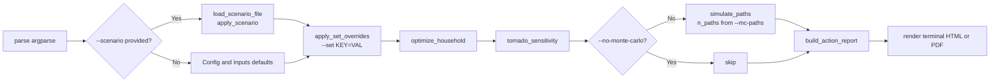

Key flags worth knowing:

- `--scenario FILE` — load JSON scenario; defaults applied for any
  unspecified field
- `--set KEY=VAL` — ad-hoc override (e.g. `config.bracket_fill_target=0.32`)
- `--print-defaults` — dump the full `Config + Inputs` as JSON
  (canonical reference)
- `--mc-paths N` — Monte Carlo paths (default 300)
- `--no-monte-carlo` — skip MC, deterministic only
- `--output {md,html,pdf,all,none}` — output formats
- `--year-table-scope {full,retirement}` — year-by-year table scope
- `--cross-model` — run all four MarketModels + emit agreement table

---

## 8. Dependency cheat-sheet

If you want to **change X**, edit Y:

| Goal | Module |
|---|---|
| Add a new IRS contribution cap (e.g. new account type) | `limits.py` + `inputs.py` + `simulator.py` |
| Add a new state's income tax | `tax/state.py` (`StateTaxRegime` instance) |
| Change a federal bracket / std deduction | `tax/regimes.py` |
| Add a new market-return model | `market.py` (implement `MarketModel` Protocol) |
| Change spending shape (e.g. new "smile" parameter) | `spending.py` |
| Modify Roth-conversion sizing | `conversion.py::planned_roth_conversion` |
| Change deficit cascade order | `withdrawals.py::cover_deficit` |
| Add a new optimizer axis | `optimizer.py::_build_decision_vector_meta` + `x_to_overrides` |
| Change Monte Carlo aggregation | `monte_carlo.py::MonteCarloResult.summary()` |
| Add a new tornado knob | `sensitivity.py::_TORNADO_KNOBS` |
| Change the action-report layout | `report.py::build_action_report` |
| Add a new CLI flag | `__main__.py::_build_argparser` |
| Add a new diagnostic column to the year-by-year DataFrame | `simulator.py` (the big `rows.append({...})` block) |
| Add a new JSON scenario knob | `config.py` or `inputs.py` (dataclass field) + `scenario.py` (auto-validated) + `scenarios/template.json` (drift test enforces) |

---

## 9. Where the cross-cutting flows live

### Contribution cascade (the paycheck → buckets flow)

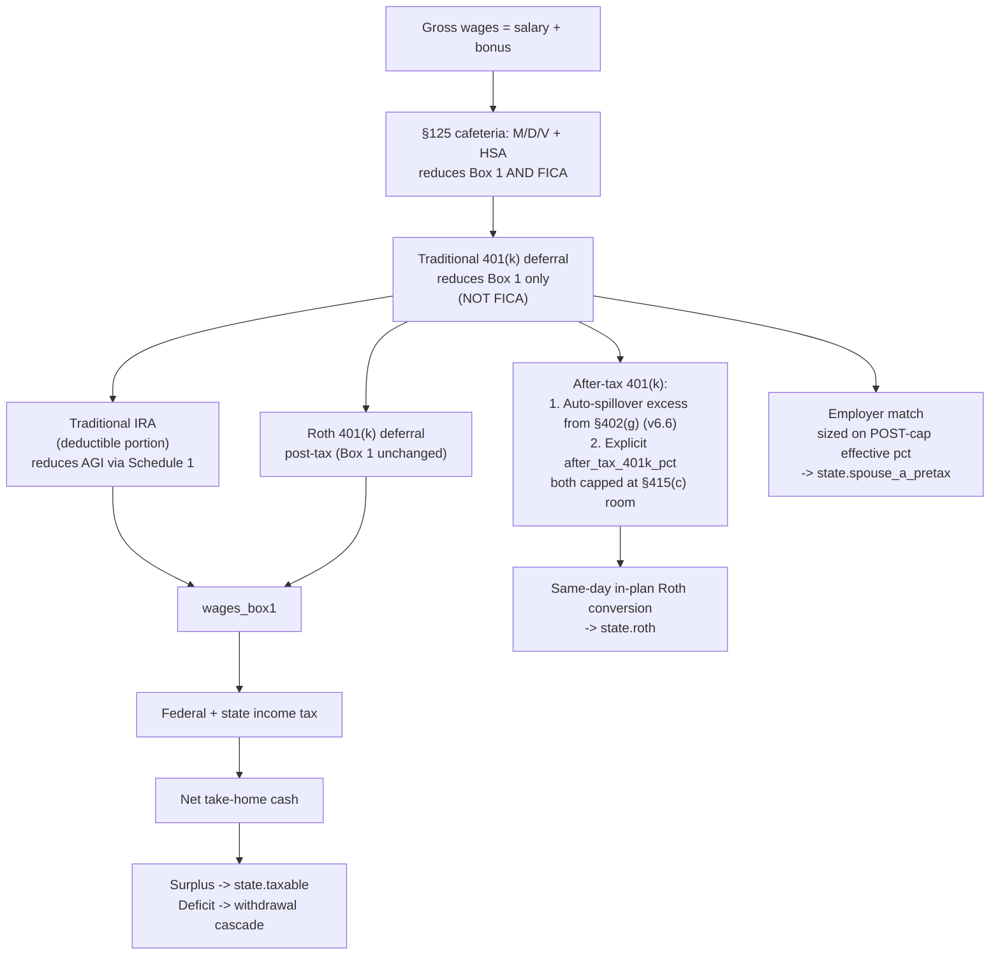

This is implemented in [`tax_optimizer/simulator.py`](../tax_optimizer/simulator.py)
lines ~185–310 (contributions + spillover + mega-backdoor) and ~340–390
(wages_box1 + FICA + SDI).

### Tax pipeline (working-year)

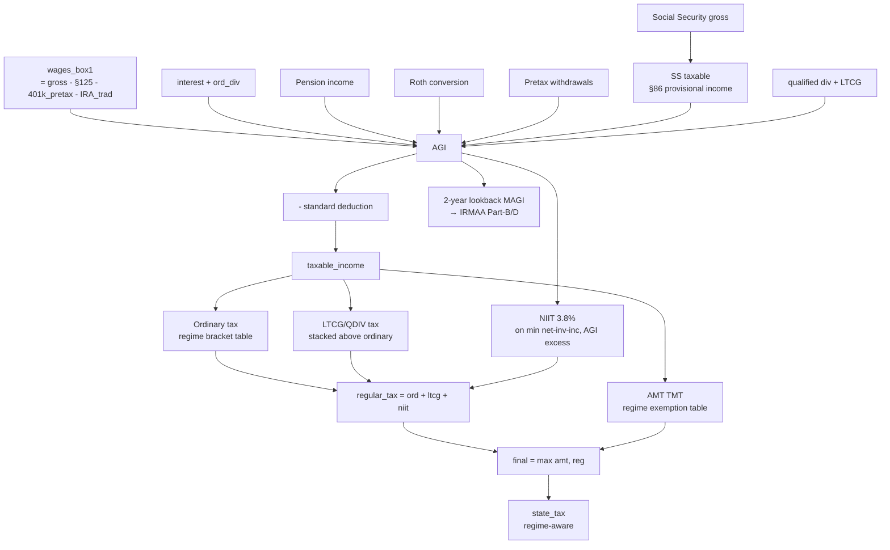

Implemented in [`tax_optimizer/tax/federal.py`](../tax_optimizer/tax/federal.py)
+ [`tax_optimizer/tax/state.py`](../tax_optimizer/tax/state.py) +
[`tax_optimizer/tax/irmaa.py`](../tax_optimizer/tax/irmaa.py). The
simulator threads the right inputs into each.

### Roth-conversion sizing (v6.5 liquidity guard)

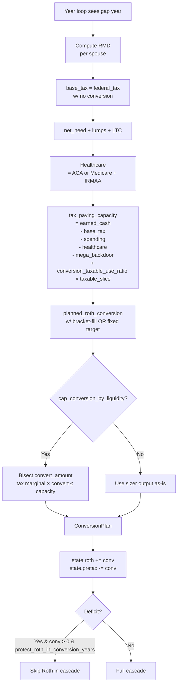

### Monte Carlo / optimizer relationship

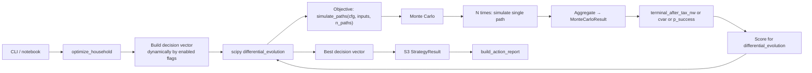

The optimizer is the most computationally expensive entry point —
`simulate()` runs `n_paths × n_iterations × pop_size` times. The
optimizer caches partial work where possible and exposes a
`maxiter` knob via `cfg.optimize_max_iter`.

---

## 10. Conventions worth knowing

- **Frozen dataclasses for inputs, mutable `State` for runtime balances.**
  Don't mutate `Config` or `Inputs` in-place inside the simulator —
  use `dataclasses.replace`. The `State` object is the one designated
  mutable cell.
- **Stateless primitives, stateful simulator.** Every module in section
  4 above is either pure functions or near-pure (the `MarketModel`
  classes hold a sampling RNG but no scenario state). The simulator
  is the only "knows about the year loop" piece.
- **Diagnostic columns ride free.** Adding a new diagnostic (e.g.
  `mega_backdoor_spillover_a` in v6.6) just appends to the
  `rows.append({...})` dict. Backward-compatible — old consumers
  just don't read the new column.
- **Drift tests enforce the JSON template.** Any new `Config` or
  `Inputs` field MUST be mirrored into [`scenarios/template.json`](../scenarios/template.json) or
  [`tests/test_scenario_template.py`](../tests/test_scenario_template.py) will fail loudly. Same for nested dataclasses
  like `HealthPremiums` (the parametrize list in the drift test must
  include them).
- **CHANGELOG is the migration log.** Every behavior change (including
  silent defaults flipping) gets a `[Unreleased]` entry with the
  knob that brings the legacy behavior back.

---

## 11. Further reading

- [`docs/scenario_guide.md`](scenario_guide.md) — exhaustive JSON
  scenario reference (all knobs, every nested block, polymorphic
  forms)
- [`docs/market_models.md`](market_models.md) — deep dive on the four
  `MarketModel` implementations and CMA preset selection
- [`scenarios/README.md`](../scenarios/README.md) — top-level scenario
  directory README covering Roth-conversion + withdrawal knobs, §125
  health premiums, and mega-backdoor auto-spillover
- [`CHANGELOG.md`](../CHANGELOG.md) — every behavior-affecting change,
  most recent first
- [`README.md`](../README.md) — top-level repo overview + CLI usage
