# `tax_optimizer` — module architecture

A reference for **what each module does, how the modules fit together,
and where to look** when you need to understand or extend a particular
piece of the simulator. Use this alongside
[`modeling_guide.md`](modeling_guide.md) (the end-to-end "how do I
model X" task guide), [`scenario_guide.md`](scenario_guide.md) (JSON /
Inputs surface), [`dashboard.md`](dashboard.md) (the Dash UI), and
[`market_models.md`](market_models.md) (return generators).

The package now ships in two top-level Python sub-packages — the
simulator core (`tax_optimizer/`) and the Plotly Dash front-end
(`dash_app/`). This doc covers both. Material in section 9 below is
the Dash architecture; everything earlier covers the simulator core.

This document tracks the source as of the current ``main`` branch.
Notable additions since the v6.6 architecture snapshot:

- **Single-filer household** (`Inputs.household_kind = "single"`) —
  one filer for the entire horizon, never-married, with `single`
  filing status from year 0. Spouse-B fields are silently ignored.
- **Annuity account type** (`Inputs.annuity` + `tax_optimizer/annuity.py`)
  — qualified or non-qualified contracts with monthly payouts and the
  IRC §72(b) exclusion ratio for non-qualified contracts.
- **Pension and annuity lump-sum knob** (`pension.lump_sum_mode` /
  `annuity.lump_sum_mode`) — `none` / `rollover_pretax` / `cash`,
  with §72(t)/§72(q) early-distribution penalty handling.
- **Plotly Dash front-end** (`dash_app/`) — Simple/Advanced scenario
  form, single / four-strategy / four-plus-MC run modes, six results
  tabs, downloadable HTML report. Production launcher
  (`tax-optimizer-app-prod`) wraps the same `app.server` in
  `waitress`.

Newer changes will be linked from [`CHANGELOG.md`](../CHANGELOG.md) if
the architecture shifts materially.

---

## 1. Bird's-eye view

The package is built in **four functional layers** inside
`tax_optimizer/`, with an optional **Dash front-end** in `dash_app/`
on top:

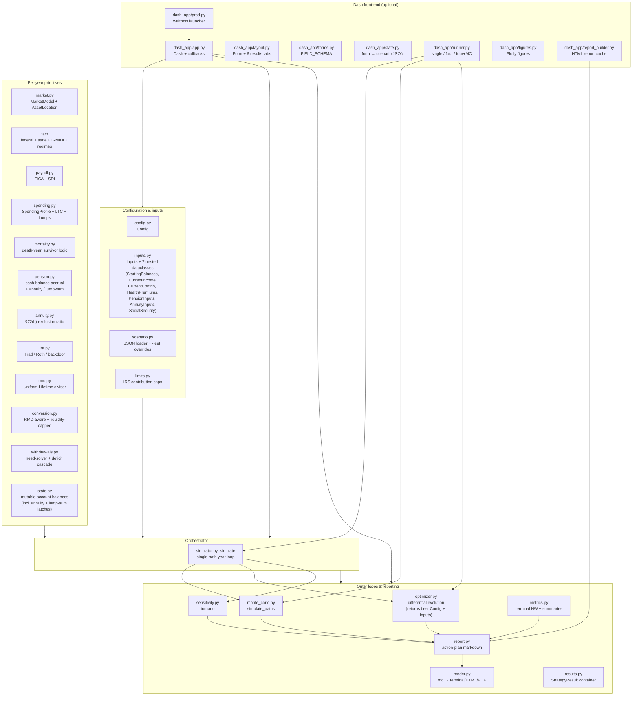

**Read top-to-bottom**: the configuration layer feeds the engine
primitives, which feed the single-path simulator, which feeds the outer
loops (Monte Carlo, optimizer, sensitivity) and the report builder.
The simulator is the only piece that "knows the year loop"; every other
module is either a configuration input, a stateless primitive, or a
consumer of `simulate()` output.

The Dash app is a thin orchestration layer — it never re-implements
simulator logic. It just rebuilds `Config` + `Inputs` from form state
(`dash_app/state.py`), dispatches a workload (`dash_app/runner.py`),
and renders the resulting frames as Plotly figures
(`dash_app/figures.py`) plus a downloadable HTML report
(`dash_app/report_builder.py` → `tax_optimizer.report.build_action_report`).

---

## 2. Public entry points

Most users touch one of these:

| Entry point | When to use it | Returns |
|---|---|---|
| `tax_optimizer.simulate(cfg, inputs)` | Single deterministic path, useful for sanity checks and notebooks | `pandas.DataFrame` with one row per year (~140 columns) |
| `tax_optimizer.simulate_paths(cfg, inputs, n_paths=...)` | Stochastic multi-path Monte Carlo | `MonteCarloResult` with `.summary()` / `.percentiles()` / `.cvar_terminal()` / `.prob_success()` |
| `tax_optimizer.optimize_household(cfg, inputs, ...)` | Find best decision-vector settings via differential evolution | `tuple[Config, Inputs, np.ndarray]` — best `Config`, best `Inputs`, raw decision vector |
| `tax_optimizer.optimize_s3(...)` | Backward-compat alias for `optimize_household` | Same as above |
| `tax_optimizer.build_action_report(cfg, inputs, results, ...)` | Render the multi-section markdown action plan | Markdown string |
| `python -m tax_optimizer --scenario file.json` | CLI: load → strategies → tornado → report end-to-end | Stdout markdown (default), or HTML via `--report PATH` |
| `python -m dash_app` (= `tax-optimizer-app`) | Launch the interactive Dash dashboard (dev server) | Dash UI on `http://127.0.0.1:8050` |
| `tax-optimizer-app-prod` | Launch the same Dash app under `waitress` (production WSGI server) | Dash UI; no Werkzeug warning |

The four canonical comparison strategies (`S0_baseline`,
`S1_all_roth_401k`, `S2_bracket_fill_22`, `S3_optimized`) are not
returned by `optimize_household` itself — that function returns the
best `(cfg, inputs, x)` for a single objective. The S0/S1/S2/S3
bundle is built by the CLI's strategy comparison code (in
`__main__.py` / `report.py`) and by the Dash app's
[`dash_app/runner.py`](#9-dash-app-architecture).

Everything else is a building block called by these.

---

## 3. Configuration layer

These modules describe the **inputs**: scenario semantics, knob shapes,
defaults, and how user-supplied JSON gets parsed and validated.

### `tax_optimizer/config.py` — `Config`

The **simulation-wide knobs** that aren't household-specific. Two
broad categories:

- **Macro assumptions** — `inflation`, `wage_growth`, `taxable_drag`,
  `nominal_growth_rate` (fallback when no `market` block is set)
- **Strategy / policy choices** — `withdrawal_strategy`,
  `bracket_fill_target`, `roth_conversion_target_bracket`,
  `roth_conversion_amount`, `cap_conversion_by_liquidity`,
  `protect_roth_in_conversion_years`,
  `conversion_taxable_use_ratio`, `section125_reduces_fica_wages`,
  `rmd_start_age`, `aca_enabled`, `stepup_at_first_death`,
  `optimize_ss_claim_age`, etc.

Also bundles three pluggable sub-objects:

- `mortality: Mortality` — when each spouse dies and survivor benefit handling
- `market: MarketModel | None` — the return generator (see `market.py`)
- `spending: SpendingProfile | None` — base + smile + LTC + lumps
- `asset_location: AssetLocation` — per-bucket equity/bond split

`Config` is a frozen `dataclass`. Mutation goes through `dataclasses.replace`
or the scenario-overrides mechanism in `scenario.py`.

### `tax_optimizer/inputs.py` — `Inputs`

The **household-specific data**: spouse ages, retire ages, salaries,
contribution percentages, Roth-401(k) splits, employer-match terms,
starting balances, Social Security claim ages, pension cash-balance
inputs, §125 health-insurance premiums, and the (newer) annuity
contract block.

A top-level discriminator `Inputs.household_kind` selects single-
vs. married-filing-jointly behavior:

```python
HouseholdKind = Literal["mfj", "single"]
```

When `household_kind == "single"`, every `spouse_b_*` field is
silently ignored; the simulator forces `alive_b = False` and
`filing_status = "single"` from year 0 (see section 5). Default
`"mfj"` keeps every existing scenario byte-for-byte unchanged.

Seven nested dataclasses live on `Inputs`:

| Nested block | Purpose |
|---|---|
| `StartingBalances` | Year-0 account balances per bucket (incl. per-spouse pretax-IRA / pretax-401(k) split for the backdoor pro-rata rule) |
| `CurrentIncome` | Salaries / bonuses / interest / div / cap-gains |
| `CurrentContrib` | HSA family contribution target |
| `HealthPremiums` | §125 medical / dental / vision per spouse |
| `PensionInputs` | Cash-balance starting balance, NRD, BP-RAP inputs, **`lump_sum_mode`** (`none` / `rollover_pretax` / `cash`) |
| `AnnuityInputs` | Separate annuity contract bucket: `balance_today`, `monthly_at_start`, `start_age`, `tax_kind` (`qualified` / `non_qualified`), `cost_basis`, `expected_payout_years`, **`lump_sum_mode`** |
| `SocialSecurity` | Per-spouse claim age + monthly benefit (PIA at FRA), legacy single `start_age` fallback |

`Inputs.__post_init__` cross-validates the flat + nested fields. Hot
paths that fail loudly:

- `lump_sum_mode` must be one of `"none" / "rollover_pretax" / "cash"`
  for both pension and annuity (typos surface at construction time).
- `annuity.tax_kind == "non_qualified"` + `lump_sum_mode == "rollover_pretax"`
  is forbidden (IRC §408 prohibits rolling a non-qualified annuity
  into a qualified IRA).
- `annuity.expected_payout_years > 0` and `annuity.cost_basis >= 0`
  whenever `tax_kind == "non_qualified"`.

The deprecated `Inputs.annual_expenses` field is preserved for legacy
scenario JSON but no longer drives the simulator; spending now lives on
`cfg.spending`.

### `tax_optimizer/scenario.py` — JSON loader + `--set` overrides

Parses a scenario JSON, validates every key against the dataclass
fields (typos raise `ScenarioError` with a targeted hint), coerces
polymorphic blocks (`market`, `spending`, `state_regime`,
`tax_regime`), and applies any `--set DOTTED.PATH=VALUE` overrides
from the CLI.

Three knobs of note in the legacy-migration path:

- `spouse_*_retire_age` used to live on `Config`; now on `Inputs` (legacy
  hint emitted with the new field path)
- `ss_start_age` / `pension_start_age` used to live on `Config`; now on
  `inputs.ss.start_age` / `inputs.pension.start_age` (same legacy hint)

A round-trip helper `scenario_to_dict(cfg, inputs)` reverses the parse
— used by `--print-defaults`.

### `tax_optimizer/limits.py` — IRS contribution caps

Plain constants + small helper functions:

- `ELECTIVE_DEFERRAL_LIMIT = 23_500` (§402(g) 2026 nominal)
- `ELECTIVE_DEFERRAL_CATCH_UP_50 = 7_500`
- `SECTION_415C_LIMIT = 70_000` (overall annual additions cap)
- `IRA_CONTRIBUTION_LIMIT = 7_500` (+ catch-up)
- `HSA_FAMILY_LIMIT = 8_550` + `HSA_FAMILY_CATCH_UP_55 = 1_000` per spouse
- `OASDI_WAGE_BASE_2026 = 176_100` (also referenced from `payroll.py`)

Helpers: `elective_deferral_cap(age)`, `hsa_family_cap(age_a, age_b, either_working)`,
`ira_contribution_limit(age)`. Catch-up is **excluded** from §415(c)
per IRS — used by the mega-backdoor room calc in `simulator.py`.

---

## 4. Per-year engine primitives

These modules implement stateless or near-stateless **building blocks**.
The simulator picks them up and assembles them in the right order each
year.

### `tax_optimizer/tax/` — federal + state + IRMAA + regimes

The tax engine. Four submodules:

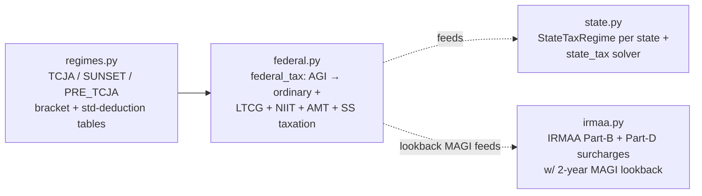

**`tax/regimes.py`** packages the bracket + threshold + standard-deduction
tables for each filing status. Five named regimes:

- `TCJA_EXTENDED` (default through 2025, extended) — 10/12/22/24/32/35/37
- `SUNSET_2026` (TCJA expiry) — 10/15/25/28/33/35/39.6
- `PRE_TCJA_2017` (historical sanity check)
- `STATELESS_RAW` (federal only — never used directly, used as base for state)

The regime swap is driven by `cfg.regime_change_year_offset` +
`cfg.regime_change_target` — useful for stress-testing the TCJA sunset.

**`tax/federal.py::federal_tax(...)`** is the per-year federal tax
solver. It composes:

1. Provisional-income calc → portion of SS taxable (via
   `social_security_taxable`)
2. Ordinary income tax on `taxable_income = AGI − std_deduction`
3. LTCG / QDIV tax stacked above the ordinary base
4. NIIT 3.8% on the lesser of net-investment-income vs. MAGI excess
5. AMT (TMT) using the regime's exemption table
6. Final tax = `max(AMT, regular_tax_with_LTCG)`
7. Plus an **early-distribution penalty** (10% × `early_distribution_taxable`)
   added on top, returned in the result dict as
   `early_distribution_penalty` and rolled into `total_tax`.

Two annuity-aware kwargs surfaced in the latest version:

- `annuity_taxable` — taxable portion of annuity contract distributions
  (qualified: full payment; non-qualified: payment minus the §72(b)
  excluded part). Routed into the ordinary-income stack alongside
  `pension`, `pretax_withdrawal`, and `roth_conversion`.
- `early_distribution_taxable` — dollars subject to the IRC §72(t) /
  §72(q) 10% additional tax (e.g. a pension or annuity cash lump sum
  while spouse A is < 59½). The principal itself is also passed through
  `pension` / `pretax_withdrawal` / `annuity_taxable` so AGI is correct;
  this kwarg adds *only* the 10% surtax on top.

Helper `amount_to_fill_bracket(filing, agi, target_bracket, regime, year_offset)`
gives the dollars between the current marginal rate and a target
bracket ceiling — drives the **bracket-fill Roth conversion sizing**
in `conversion.py`.

**`tax/state.py::StateTaxRegime`** is per-state and bundles ordinary
brackets, std-deduction, dependent treatment of LTCG (some conform,
some don't), and SDI rate + wage cap. Five regimes ship in-box:
`CA`, `NY`, `IL`, `MA`, `STATELESS`. The simulator looks up via
`cfg.state_regime` (string label like `"CA"` accepted at JSON parse).

`state_tax(regime, filing_status, wages_box1, ...)` returns a
state-tax dict. Same regime-swap mechanism as federal:
`cfg.state_regime_change_year_offset` + `cfg.state_regime_change_target`.

**`tax/irmaa.py::lookup(magi, year, filing_status)`** returns a dict
with `tier`, `total_yearly`, etc. The simulator passes the **2-year
lookback MAGI** (per SSA rules) via `cfg.irmaa_lookback_years`. The
brackets inflate at `cfg.inflation` to keep real IRMAA roughly
constant.

### `tax_optimizer/payroll.py` — FICA + state SDI

`fica_employee(wages, ...)` and `fica_household(wages_a, wages_b, ...)`
compute OASDI + base Medicare + Additional Medicare. The household
variant reconciles Form-8959 (the 0.9% Additional Medicare surcharge
applies at the **household** MFJ threshold of $250k combined wages,
not $200k per W-2).

`state_sdi(wages, rate, wage_cap)` is the per-spouse state-disability
withholding (e.g. CA SDI at 1.1% uncapped since SB 951 in 2024).

v6.6: when `cfg.section125_reduces_fica_wages = True` (default), the
simulator passes the **post-§125** wages (gross − HSA − M/D/V) to
both `fica_household` and `state_sdi`. Pre-v6.6 the package
approximated FICA on gross wages (documented in `payroll.py`'s
header docstring).

### `tax_optimizer/market.py` — `MarketModel` + asset location

Four `MarketModel` implementations satisfy the same protocol:

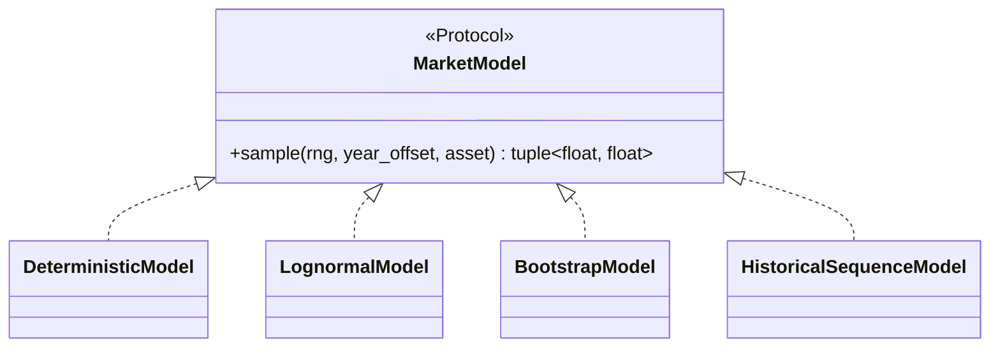

| Model | Use case | Distinguishing knob |
|---|---|---|
| `DeterministicModel(equity, bond)` | Sanity checks, back-compat with scalar growth | Constant returns |
| `LognormalModel(eq_mu, eq_sigma, bond_mu, bond_sigma, equity_bond_corr, cape_today, cape_long_run)` | Default for Monte Carlo | Optional CAPE-mean reversion + cross-asset correlation |
| `BootstrapModel(history_csv)` | Empirical resampling | Block-bootstrap or i.i.d. annual draws |
| `HistoricalSequenceModel(history_csv, start_year)` | Sequence-of-returns stress test (e.g. "what if 1966 happens again") | Replays a contiguous historical slice |

`AssetMix(equity_pct, label)` and `AssetLocation(pretax, roth, taxable, hsa)`
give per-bucket equity weights so the simulator can compute returns
per bucket each year. `AssetLocation.uniform(equity_pct)` is the
convenience constructor used by the JSON `"uniform_equity_pct"` form.

`CMA_PRESETS` is a dict of named capital-market-assumption bundles
(Vanguard 10y, Research Affiliates, BlackRock 30y, etc.) →
convenience builder `lognormal_from_cma(name, **overrides)`.

See [`docs/market_models.md`](market_models.md) for the deep dive on
all four models and CMA selection.

### `tax_optimizer/spending.py` — `SpendingProfile`

The retirement-spending model. Two `kind`s, plus `LumpEvent` and
`LongTermCareShock`:

- `SpendingProfile.flat(base_spending)` — flat real spending,
  CPI-grown only
- `SpendingProfile.smile(base_spending, ltc_years, ltc_annual_today, ...)`
  — Blanchett/Bernicke "go-go / slow-go / no-go" curve with an LTC
  shock attached at the end (default last 3 years)

Both produce per-year `nominal_need(year_offset)` floats. Lumps
(`LumpEvent`) are one-time bumps in a specific year (vacation,
new roof, college tuition shortfall). The simulator pulls all of
these together in the working-year loop.

### `tax_optimizer/mortality.py` — death year + survivor logic

`Mortality(year_of_death_a, year_of_death_b, pension_survivor_pct, ss_survivor_keeps_higher)`.

When one spouse dies in year `y`:

- Filing status switches `mfj → single` from year `y+1` onward
- The survivor inherits the deceased's pretax + Roth balances (modeled
  as a single account — the survivor's account now holds combined
  balances). Inherited-IRA 10-year rule is NOT modeled (known limit).
- Pension annuity survives at `pension_survivor_pct` (e.g. 0.5 for J&S 50%)
- Social Security survivor benefit: if `ss_survivor_keeps_higher = True`,
  the survivor keeps the larger of the two benefits

`death_year_for_path(rng)` gives stochastic-mortality support for Monte
Carlo (drawn from a SSA-derived distribution).

### `tax_optimizer/pension.py` — cash-balance projection

Calibrated to the **BP Retirement Accumulation Plan (RAP)**:

- `project_pension_balance(starting, gross, years_to_nrd, wage_growth, ...)`
  rolls forward the cash-balance from today to spouse-A's NRD using
  tiered pay credits + interest credits (pre-2016 floor of 4.5% for
  legacy participants, otherwise IRC §417(e) segment rates)
- `pension_annual_credit(eligible_earnings, years_of_service, ...)`
  is the per-year credit amount (used in the working-year loop to
  grow the balance)
- `pension_annuity_at_nrd(balance, ...)` converts the cash balance
  to a J&S annuity using IRS §417(e) factors

Knobs come from `inputs.pension`: `balance_today`, `monthly_at_nrd`,
`start_age`, `years_of_service_today`, `pre_2016_participant`,
`interest_rate`, `irs_comp_limit_today`, **`lump_sum_mode`**.

The `lump_sum_mode` knob is interpreted by the simulator's pension
lump-sum gate (see section 5). It is one-shot — once fired, the
`state.pension_lump_sum_done` latch prevents the monthly-annuity
initializer from re-creating the annuity in subsequent years.

### `tax_optimizer/annuity.py` — IRC §72(b) exclusion ratio

Tiny side-effect-free helper module. Exports a single function:

```python
exclusion_ratio(cost_basis, annual_payment, expected_payout_years) -> float
```

Returns the §72(b) exclusion ratio for non-qualified annuity payments
(the fraction of each annual payment that is tax-free return-of-basis).
Approximates the IRS-published life-expectancy denominator
(Treas. Reg. §1.72-9, Table V) with `annual_payment * expected_payout_years`
so the user can tweak the recovery horizon directly via
`inputs.annuity.expected_payout_years` (default 20).

The simulator separately tracks `state.annuity_basis_remaining` and
flips each payment to 100% taxable once the cumulative excluded
amount has matched the cost basis — independent of any discrepancy
between `expected_payout_years` and the actual horizon. The full
annuity behavior (pre-payout growth, lump-sum gate, monthly payment
splitting, survivor scaling) lives inline in
[`tax_optimizer/simulator.py`](../tax_optimizer/simulator.py); this
module just hosts the exclusion-ratio math because it's the only
piece worth unit-testing in isolation.

See [`docs/annuity_guide.md`](annuity_guide.md) for the end-user
walkthrough — qualified vs. non-qualified contracts, the three
lump-sum modes, validation errors, and FAQ.

### `tax_optimizer/ira.py` — Traditional / Roth / backdoor

Per-spouse helper bundle. Each spouse can split their annual IRA
contribution across three paths, sharing one cap:

- `traditional_ira_contribution` (deductible Trad)
- `roth_ira_contribution` (direct, MAGI-phased-out)
- `backdoor_roth` (non-deductible Trad → same-day conversion)

`size_ira_contributions(...)` returns a `IRAContribResult` dataclass
with each path sized for the cap, the MAGI phase-out for direct Roth,
and the pro-rata adjustment for backdoor (only the IRA-only sub-balance
counts; 401(k) doesn't pro-rata with IRA).

### `tax_optimizer/rmd.py` — Required Minimum Distribution

`rmd_amount(balance, age, rmd_start_age)` returns the year's RMD
using the IRS Uniform Lifetime divisor table (ages 72–110 baked in).
RMDs are **per-spouse on their own pretax** — surfaced as separate
`a_rmd` and `b_rmd` in the simulator so the household's combined RMD
isn't computed on a fictional joint balance.

The simulator eats RMD-occupied bracket room before sizing the Roth
conversion (RMD-aware conversion logic in `conversion.py`).

### `tax_optimizer/conversion.py` — `planned_roth_conversion`

Two sizing modes (one chosen per scenario):

1. **Fixed-amount** (`cfg.roth_conversion_amount > 0`) — convert
   exactly that many dollars
2. **Bracket-fill** (`cfg.roth_conversion_target_bracket > 0`) — fill
   the target bracket exactly (using `amount_to_fill_bracket` from
   `tax/federal.py`)

v6.5 added a **liquidity guard** layered on top of either mode. The
sizer now bisects on `convert_amount` to find the largest amount
whose marginal federal+state tax stays within the household's
`tax_paying_capacity` (passed in by `simulator.py`). Returns a
`ConversionPlan(conv_a, conv_b, capped_by_liquidity, bracket_target_total)`
NamedTuple.

> **See [`docs/roth_conversion.md`](roth_conversion.md)** for the full
> mechanism walkthrough — `tax_paying_capacity` derivation, bisection
> mechanics, Roth-protection rationale, worked numerical example, and
> the seven knobs that control all of it.

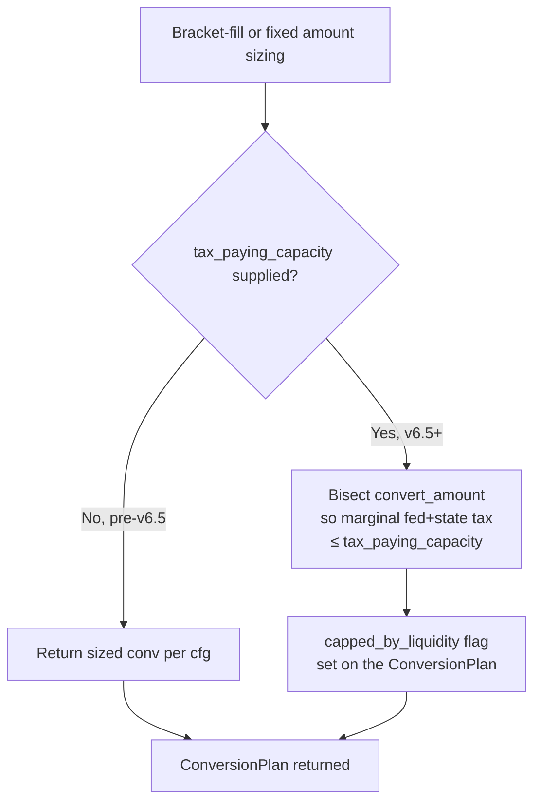

`simulator.py` then converts on the spouse-A pretax first, spouse-B
pretax second (canonical ordering; revisitable as a future per-spouse
optimization axis).

### `tax_optimizer/withdrawals.py` — need-solver + deficit cascade

Two entry points:

- `withdraw_for_need(net_need, state, ...)` — for the "conventional"
  withdrawal strategy, solves jointly for taxable / pretax / Roth /
  HSA withdrawals that **net** to the target spending. Includes
  iterative federal/state tax solver because pretax withdrawals
  generate tax.
- `cover_deficit(deficit, state, ...)` — used when the household's
  cash inflow falls short. Cascades through buckets in order:

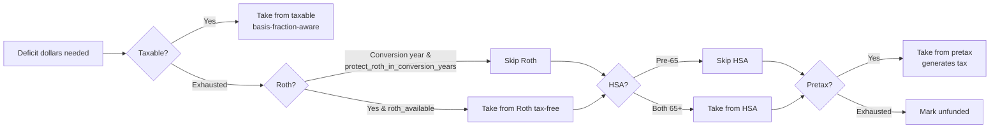

The cascade respects:

- **Capital-gains basis fraction** on taxable withdrawals
  (`cfg.cap_gains_basis_fraction`, live-tracked basis via `state.basis_fraction`)
- **Roth 5-year clock** — not modeled, but v6.5
  `protect_roth_in_conversion_years` excludes Roth from the cascade
  in any year a conversion fires (prevents silent Roth-raid to pay
  conversion tax)
- **HSA pre-65 penalty** — HSA only enters the cascade once both
  spouses are 65+ (or the older spouse is 65+ and the younger is
  retired)
- **Pretax tax-on-withdrawal** — iteratively solves federal+state
  marginal so the *gross* withdrawal is sized to land at the target
  *net*

Unfunded dollars surface in the `unfunded` column of the simulation
DataFrame — the closest proxy this package has to "this plan fails
in year N".

### `tax_optimizer/state.py` — `State`

Tiny dataclass holding the mutable per-year account balances:

```python
@dataclass
class State:
    year: int
    spouse_a_age: int
    spouse_b_age: int
    spouse_a_pretax: float            # combined pretax IRA + 401(k)
    spouse_b_pretax: float
    spouse_a_pretax_ira: float        # IRA-only sub-balance, drives §408(d)(2) pro-rata
    spouse_b_pretax_ira: float
    roth: float
    taxable: float
    hsa: float
    pension_balance: float
    pension_annuity: float            # per-year payout amount once active
    annuity_balance: float            # separate annuity contract bucket
    annuity_payment: float            # per-year payout (nominal, no COLA)
    annuity_basis_remaining: float    # un-recovered §72(b) basis (non-qualified only)
    pension_lump_sum_done: bool       # one-shot latch for pension lump-sum gate
    annuity_lump_sum_done: bool       # one-shot latch for annuity lump-sum gate
    cumulative_basis: float
    prior_agi: float                  # AGI from year T-1 (IRA MAGI estimate)
    agi_lag_2: float                  # AGI from year T-2 (IRMAA lookback)
```

Pass-by-mutation through the year loop. `state.py` is intentionally
boring — it's the single mutable cell that ties together all the
otherwise-stateless engine primitives.

Three field clusters earn their own callouts:

- **`spouse_*_pretax_ira`** is the IRA-only sub-balance carved out of
  `spouse_*_pretax`. The §408(d)(2) backdoor-Roth pro-rata rule
  aggregates *only* Trad/SEP/SIMPLE IRA balances (NOT 401(k)). Before
  this split, the simulator passed combined pretax to
  `allocate_ira_contributions` and over-stated the taxable conversion
  fraction for any spouse with rolled-over 401(k) money.
- **Annuity bucket** (`annuity_balance` / `annuity_payment` /
  `annuity_basis_remaining`) is initialized from `inputs.annuity` and
  driven entirely by the simulator's pension/annuity blocks
  (section 5). Stays at zero for households without an annuity.
- **Lump-sum latches** (`pension_lump_sum_done` /
  `annuity_lump_sum_done`) are one-shot booleans flipped the first
  time the corresponding gate fires. Subsequent years skip the gate
  *and* the monthly-annuity initializer, so a lump-sum'd contract
  doesn't silently get re-created from the user's `monthly_*` input
  in later years.
- **AGI lag chain** (`prior_agi` / `agi_lag_2`) is rolled forward at
  the end of each iteration so year T+1 starts with the right
  T-1/T-2 lookback values. Used by IRA MAGI estimates (TC-5) and
  IRMAA's 2-year lookback (TC-11).

---

## 5. The orchestrator — `tax_optimizer/simulator.py`

This is **where the year loop lives**. ~1,500 lines, single function
`simulate(cfg, inputs, *, rng=None) -> pandas.DataFrame`. Per year:

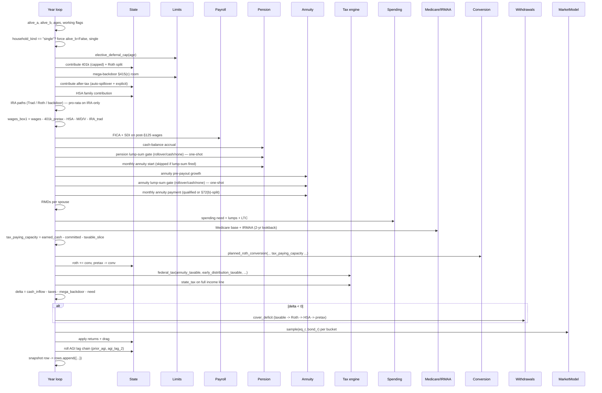

### Single-filer override

When `inputs.household_kind == "single"`, the year loop forces
`alive_b = False` and `filing_status = "single"` at the very top of
each iteration — *before* every downstream "if alive_b" branch fires.
This bypasses `Mortality.filing_status`'s year-of-death MFJ exception
(a never-married single filer never gets an MFJ year) and routes
every tax / FICA / IRMAA / SS-provisional code path through the
Single tables already present in the regime. The Spouse-B inputs
themselves stay in the scenario JSON so a flip back to `"mfj"`
restores the original household without re-entry.

### Pension and annuity lump-sum gates

Two parallel one-shot gates sit between income setup and the tax
pipeline:

```mermaid
flowchart TD
    Loop[Year loop]
    Loop --> Pen{a_age >= pension.start_age<br/>AND lump_sum_mode != none<br/>AND not pension_lump_sum_done?}
    Pen -->|"rollover_pretax"| Roll1[pretax_a += balance<br/>pretax_a_ira += balance]
    Pen -->|"cash"| Cash1[pension_lump_sum_taxable = balance<br/>+ §72(t) penalty if a_age < 60]
    Pen -->|"none"| Monthly1[Initialize monthly annuity<br/>if not already running]
    Roll1 --> SetDone1[pension_lump_sum_done = True<br/>pension_balance = 0<br/>pension_annuity = 0]
    Cash1 --> SetDone1
    SetDone1 --> Ann
    Monthly1 --> Ann
    Ann{a_age >= annuity.start_age<br/>AND lump_sum_mode != none<br/>AND not annuity_lump_sum_done?}
    Ann -->|"rollover_pretax"| Roll2[pretax_a += balance<br/>qualified-only — validated upstream]
    Ann -->|"cash, qualified"| Cash2q[annuity_lump_sum_taxable = balance<br/>+ §72(q) penalty if a_age < 60]
    Ann -->|"cash, non-qualified"| Cash2nq["tax_free = min(bal, basis_remaining)<br/>annuity_lump_sum_taxable = bal - tax_free<br/>+ §72(q) penalty on gain only"]
    Ann -->|"none"| Monthly2[Monthly payment<br/>§72(b) exclusion ratio for non-qualified]
    Roll2 --> Done2[annuity_lump_sum_done = True<br/>annuity_balance = 0]
    Cash2q --> Done2
    Cash2nq --> Done2
```

Both gates fire **at most once per simulation**. The latch (`*_lump_sum_done`)
prevents the monthly-annuity initializer from re-creating the contract
in later years. Cash-mode lump sums route the principal through the
ordinary-income side via `pension` / `annuity_taxable` and the surtax
through `early_distribution_taxable` (10% × taxable principal); rollover
mode has no current-year tax (IRC §402(c) for pension, §408(d)(3) for
qualified annuity).

### Why so much hoisting

The simulator pre-computes a lot of "downstream" obligations early
(spending need, healthcare, HSA pay-down, base tax) so that
**`tax_paying_capacity`** is accurate when passed to
`planned_roth_conversion`. Without that, the conversion sizer would
fill the bracket without knowing whether the household has cash to
pay the resulting tax — leading to silent Roth-raids (the v6.5 bug).

The order is fragile but well-tested; the docstrings inline mark the
v6.5 hoisting points explicitly.

### What ends up in the DataFrame

One row per simulated year, with columns roughly grouped:

- **Identity**: `year`, `spouse_a_age`, `spouse_b_age`, `alive_a`,
  `alive_b`, `filing_status`, `regime`, `state_regime`,
  `spousal_rollover`
- **Income**: `wages`, `pension`, `ssn`, `interest_income`,
  `qualified_dividends`, `ordinary_dividends`
- **Pension lump-sum**: `pension_lump_sum`, `pension_lump_sum_event`
  (`""`, `"rollover_pretax"`, or `"cash"`)
- **Annuity**: `annuity_taxable`, `annuity_tax_free`,
  `annuity_payment`, `annuity_lump_sum`, `annuity_lump_sum_event`
- **Early-distribution surtax**: `early_distribution_penalty`
  (the 10% IRC §72(t) / §72(q) component on top of regular tax)
- **Contributions**: `elective_deferral_a/b`, `employer_match_a/b`,
  `mega_backdoor_a/b`, `mega_backdoor_spillover_a/b`,
  `excess_deferral_a/b`, `after_tax_target_uncovered_a/b`,
  `hsa_contrib`, `ira_traditional_a/b`, `ira_roth_direct_a/b`,
  `ira_backdoor_a/b`, `ira_backdoor_taxable_conv`
- **Roth conversion**: `roth_conversion`, `roth_conversion_a`,
  `roth_conversion_b`, `roth_conv_capped_by_liquidity`,
  `roth_conv_bracket_target`, `roth_conv_tax_capacity`
- **RMD**: `rmd`, `rmd_a`, `rmd_b`
- **Withdrawals**: `pretax_withdrawal`, `pretax_withdrawal_a/b`,
  `roth_withdrawal`, `taxable_withdrawal`, `hsa_withdrawal`
- **Tax**: `agi`, `taxable_income`, `federal_tax`, `marginal`,
  `state_tax`, `state_marginal`, `fica`, `fica_oasdi`, `fica_medicare`,
  `fica_additional_medicare`, `state_sdi`
- **§125 health premiums**: `health_premium_a/b`, `health_premium_total`
- **Healthcare**: `irmaa`, `irmaa_tier`, `irmaa_lookback_agi`,
  `medicare_base_premium`, `health_pre65`, `aca_benchmark_premium`,
  `aca_apt_credit`
- **Returns**: `equity_return`, `bond_return`
- **End-of-year balances**: `pretax_balance`, `pretax_a_balance`,
  `pretax_b_balance`, `roth_balance`, `taxable_balance`,
  `hsa_balance`, `pension_balance`, `annuity_balance`,
  `annuity_basis_remaining`, `cumulative_basis`
- **Stress signals**: `unfunded`, `spending_need`

This DataFrame is the universal currency consumed by every module
downstream (Monte Carlo aggregation, optimizer objective, sensitivity
tornado, action report, Dash figure builders).

---

## 6. Outer loops & reporting

### `tax_optimizer/monte_carlo.py` — `simulate_paths`

Wraps `simulate()` in a loop over `n_paths`, each with a different
`rng = np.random.default_rng(base_seed + i)`. Aggregates the
per-path terminal NW + lifetime taxes / IRMAA / ruin year into a
`MonteCarloResult` dataclass:

```python
@dataclass
class MonteCarloResult:
    paths: list[pd.DataFrame]          # only kept when keep_paths=True
    terminals: np.ndarray               # one terminal NW per path
    lifetime_taxes: np.ndarray
    lifetime_irmaas: np.ndarray
    ruin_year_offsets: np.ndarray       # -1 if no ruin
    cfg: Config
```

Methods:

- `prob_success()` — `P(ruin_year_offset < 0)` across paths
- `percentiles(levels=(5, 25, 50, 75, 95))` — per-metric quantile dict
- `cvar_terminal(alpha=0.10)` — mean of worst `alpha` fraction of
  terminal NWs (the optimizer's `cvar` mode maximizes this)
- `summary()` — flat dict with `n_paths`, `prob_success`,
  `terminal_p5/p50/p95`, `cvar_terminal_p10/p20`, `lifetime_tax_p50`,
  `lifetime_irmaa_p50`, `median_ruin_year_offset`

`simulate_paths(..., keep_paths=False)` discards the per-path
DataFrames after extracting summary stats so memory usage stays
bounded for large `n_paths`. The Dash app passes `keep_paths=True`
because it builds a per-year P10/P50/P90 fan chart from the path
collection.

### `tax_optimizer/optimizer.py` — `optimize_household`

Wraps `scipy.optimize.differential_evolution` around a **dynamically-
sized decision vector** (see `_build_decision_vector_meta`):

- Always present: `roth_401k_pct_a`, `roth_401k_pct_b`,
  `conv_bracket_idx` (discrete index into `BRACKET_CHOICES`, writes
  through to `cfg.roth_conversion_target_bracket`)
- Conditionally present (gated by `inputs` / `cfg` flags):
  - `mega_backdoor_pct_a/b` if `inputs.spouse_*_mega_backdoor_enabled`
  - `ss_claim_age_a/b` if `cfg.optimize_ss_claim_age = True`

Three objective functions selectable via `ObjectiveType =
Literal["terminal", "cvar", "p_success"]`:

- `terminal` — maximize median terminal after-tax NW
- `cvar` — maximize CVaR-α (default α=10%, left-tail focus)
- `p_success` — maximize probability of success

Each call to the objective runs the full `simulate_paths(...)` with
the candidate decision vector applied via `x_to_overrides(...)`.

`optimize_household(...)` returns a `tuple[Config, Inputs, np.ndarray]`
— the best `Config`, best `Inputs`, and the raw decision vector
`x_opt`. (Pre-run population is seeded with a coarse 4×4×|brackets|
grid sweep when the decision vector is the baseline 3-dim; higher-
dimensional runs skip the grid and rely on differential-evolution's
Sobol initialization.) The legacy alias `optimize_s3 = optimize_household`
is retained for backward-compat.

The four canonical comparison strategies (`S0_baseline` /
`S1_all_roth_401k` / `S2_bracket_fill_22` / `S3_optimized`) are built
on top of this primitive — once each in `tax_optimizer.report`'s
strategy comparison and once in `dash_app/runner.py::_build_four`.
Both call `optimize_household` for S3 specifically; S0/S1/S2 are
hand-constructed via `dataclasses.replace`.

### `tax_optimizer/sensitivity.py` — tornado

`tornado_sensitivity(cfg, inputs, base_terminal, ...)` shifts each
selected knob `±1σ` (or a discrete range, knob-dependent), re-runs the
simulator deterministically, and records the terminal-NW delta. The
result is a DataFrame sorted by absolute swing — the "what moves the
needle" chart in the action report.

Knob list is hard-coded in `sensitivity.py::_TORNADO_KNOBS` (about 12
common levers: contribution percentages, bracket fill, SS claim age,
state regime, market mu, etc.).

Plain-English summarizers `render_actions(...)` and
`render_takeaways(...)` convert the tornado DataFrame into bullet
points for the action report.

### `tax_optimizer/metrics.py` — summarizers

Stateless functions on a simulation DataFrame:

- `terminal_after_tax_nw(df, heir_marginal_rate)` — after-tax NW at
  the horizon, accounting for the deferred-tax liability on remaining
  pretax balances (the `heir_marginal_rate` knob)
- `lifetime_tax_npv(df, discount_rate)` — NPV of all federal + state
  + FICA + IRMAA paid
- `lifetime_irmaa_npv(df, discount_rate)` — NPV of IRMAA surcharges
- `summarize(df, heir_marginal_rate)` — combined dict of key metrics
  (peak marginal, terminal NW, ruin year, etc.)

These are pure functions — the optimizer's objective stack is built
from them.

### `tax_optimizer/results.py` — `StrategyResult`

Plain dataclass `(cfg, inputs, df, summary)` that bundles everything
one strategy emits — `Config` actually used to simulate it, the
possibly-mutated `Inputs` (the optimizer flips Roth-401(k) splits and
similar), the per-year DataFrame, and the `summarize(df, ...)` dict.
Used as the common currency between the optimizer, report builder,
and CLI. The Dash app uses an analogous-but-distinct
`dash_app.runner.StrategyResult` (section 9) to keep the Dash module
free of `tax_optimizer.report` imports.

### `tax_optimizer/report.py` — action-plan markdown

The big one (~1,400 lines). Builds a multi-section markdown report
from a strategy dict:

- TL;DR (with peak-marginal year + conversion window)
- Recommended plan (lever-by-lever recommendation vs. user's current)
- Expected outcomes (terminal NW, ruin year, tax breakdown)
- Top sensitivities (from tornado)
- Year-by-year action timeline (with `RETIRE @ N` divider row)
- Cross-model check (Lognormal / Bootstrap / Historical agreement —
  v6.5)
- Widow-paragraph (TCJA + survivor compression)
- Sunset-paragraph (TCJA expiry stress test)

Two top-level entry points:

- `build_action_report(cfg, inputs, results, sens_df, base_terminal, mc=None, ...)` →
  markdown string
- `compare_scenarios(scenarios_dict, ...)` → comparison table across
  multiple full scenarios

### `tax_optimizer/render.py` — markdown → terminal / HTML / PDF

Three backends:

- `render_terminal(md)` — rich-text terminal output with color and
  table formatting
- `render_html(md, path)` — standalone HTML with embedded CSS
- `render_pdf(md, path)` — uses `weasyprint` if available; falls back
  to a warning if not installed

Driven by the CLI's `--report PATH` flag (file extension picks the
backend) and by the Dash app's `dash_app/report_builder.py` for the
"Download report" button.

### `tax_optimizer/plots.py` — matplotlib helpers

Stateless functions returning `matplotlib.figure.Figure` for the
notebook's visualization cells:

- balance trajectories
- per-year tax stack
- Monte Carlo fan chart
- tornado bar chart

Package never auto-shows; the caller is responsible for `.show()` /
`.savefig()`.

---

## 7. CLI — `tax_optimizer/__main__.py`

`python -m tax_optimizer [...]` (alias: `tax-optimizer`) wraps the
Python API:

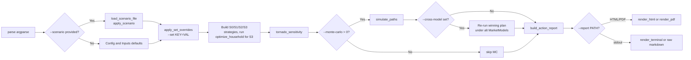

Key flags worth knowing:

- `--scenario PATH` — load JSON scenario; defaults applied for any
  unspecified field.
- `--set DOTTED.PATH=VALUE` — ad-hoc override (repeatable). Value is
  parsed as a JSON literal.
- `--print-defaults` — dump the effective `Config + Inputs` as JSON
  and exit (canonical reference).
- `--regime {tcja, pre_tcja, sunset}` — quick swap of the active
  federal tax regime.
- `--regime-change-year N` — mid-simulation regime swap.
- `--widow N` — stress test: year offset at which Spouse A dies.
- `--spending {flat, smile}` — spending profile shape.
- `--market {deterministic, lognormal, bootstrap}` — market model.
- `--monte-carlo N` — if `> 0`, run a Monte Carlo with `N` paths.
- `--mc-objective {terminal, cvar, p_success}` — optimizer objective.
- `--seed N` — master RNG seed for Monte Carlo.
- `--cross-model [MODELS]` — re-run the winning plan under alternative
  models. With no value, defaults to bootstrap + historical_sequence.
  Accepts a comma list of `lognormal`, `bootstrap`,
  `historical_sequence`, or any CMA preset (`vanguard_2025`, etc.).
  Requires `--monte-carlo > 0`.
- `--cross-model-paths N` — paths per alternative model (default 200).
- `--year-table-scope {full, retirement}` — scope of the §7
  year-by-year table.
- `--report PATH` — write the action plan to `PATH` (must end in
  `.html` or `.pdf`). When set, stdout is suppressed unless
  `--also-stdout` is given.
- `--report-archive` — also drop a timestamped HTML copy under
  `./reports/`.
- `--also-stdout`, `--quiet`, `--no-report` — output-routing modifiers.

For interactive scenario editing without writing JSON or memorizing
flags, use the Dash front-end (section 9 below) — `python -m dash_app`
or `tax-optimizer-app-prod`.

---

## 8. Dependency cheat-sheet

If you want to **change X**, edit Y:

| Goal | Module |
|---|---|
| Add a new IRS contribution cap (e.g. new account type) | `limits.py` + `inputs.py` + `simulator.py` |
| Add a new state's income tax | `tax/state.py` (`StateTaxRegime` instance) |
| Change a federal bracket / std deduction | `tax/regimes.py` |
| Add a new market-return model | `market.py` (implement `MarketModel` Protocol) |
| Change spending shape (e.g. new "smile" parameter) | `spending.py` |
| Modify Roth-conversion sizing | `conversion.py::planned_roth_conversion` |
| Change deficit cascade order | `withdrawals.py::cover_deficit` |
| Add a new optimizer axis | `optimizer.py::_build_decision_vector_meta` + `x_to_overrides` |
| Change Monte Carlo aggregation | `monte_carlo.py::MonteCarloResult.summary()` |
| Add a new tornado knob | `sensitivity.py::_TORNADO_KNOBS` |
| Change the action-report layout | `report.py::build_action_report` |
| Add a new CLI flag | `__main__.py::_build_parser` |
| Add a new diagnostic column to the year-by-year DataFrame | `simulator.py` (the big `rows.append({...})` block) |
| Add a new JSON scenario knob | `config.py` or `inputs.py` (dataclass field) + `scenario.py` (auto-validated) + `scenarios/template.json` (drift test enforces) |
| Add a new annuity behavior (e.g. inflation-adjusted payment) | `inputs.py::AnnuityInputs` + `simulator.py` (annuity block, ~lines 570–670) + `state.py` |
| Add a new pension or annuity lump-sum mode | `inputs.py` (extend `Literal[...]`) + `simulator.py` (lump-sum gate) + `__post_init__` validation |
| Add a Dash form field | `dash_app/forms.py::FIELD_SCHEMA` (single line) |
| Add a Dash results figure | `dash_app/figures.py` (pure function) + `dash_app/layout.py` (place into a tab) + `dash_app/app.py` (callback) |
| Add a new Dash run mode | `dash_app/runner.py::run_scenario` + `dash_app/app.py` (run-mode dropdown) |
| Wire a knob through both layers (model + Dash) | `inputs.py`/`config.py` field → `scenario.py` (auto-validated) → `dash_app/forms.py::FIELD_SCHEMA` → `tests/test_scenario_template.py` (drift) |

---

## 9. Dash app architecture

The Dash front-end (`dash_app/`) is a thin orchestration layer over
the simulator core. It never re-implements simulator logic; it just
rebuilds `(Config, Inputs)` from form state, dispatches a workload,
and renders the resulting frames as Plotly figures plus a downloadable
HTML report.

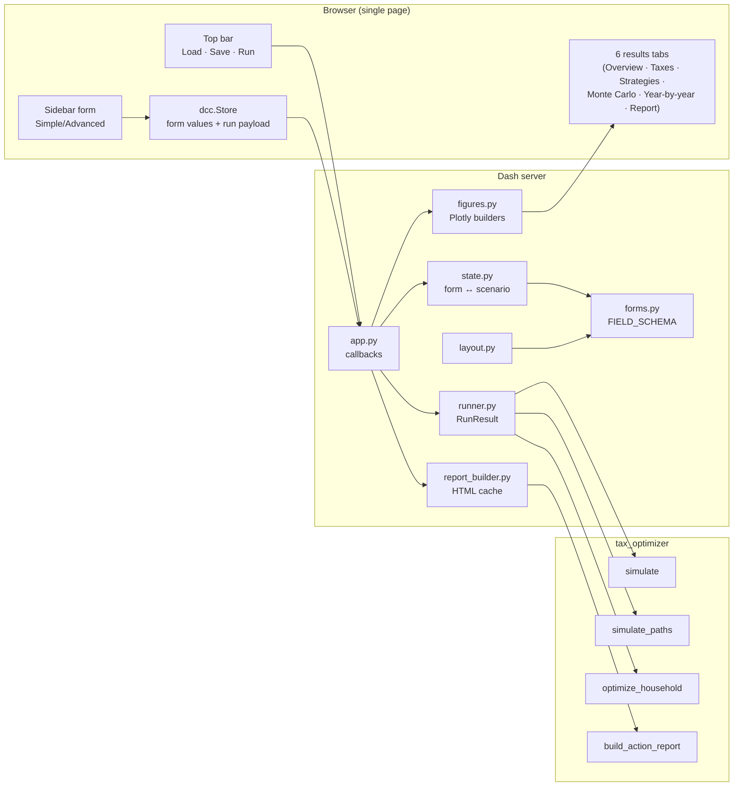

### `dash_app/__main__.py` and `dash_app/prod.py` — entry points

Two console scripts, registered in `pyproject.toml`:

- **`tax-optimizer-app`** (= `python -m dash_app`) — boots
  `make_app()` under Flask/Werkzeug's built-in dev server. Honors
  `DASH_HOST` / `DASH_PORT` env vars and `--host`, `--port`,
  `--debug` CLI flags. Prints the Werkzeug "do not use in production"
  warning, harmless for local single-user planning.
- **`tax-optimizer-app-prod`** — same `make_app().server` (the
  underlying Flask WSGI app) served via `waitress`. Adds a `--threads`
  knob (default 4). Defers the `waitress` import so the entry point
  fails with a friendly error message when the optional `prod` extra
  isn't installed (`pip install -e ".[prod]"`).

The production entry point is intentionally pure-Python +
cross-platform; we picked `waitress` over `gunicorn` because the
fork-based gunicorn doesn't run on Windows and the operational target
is "any laptop".

### `dash_app/app.py` — `make_app()` + every callback

Single module that wires the `Dash` instance and registers every
callback. Roughly:

- `make_app()` instantiates `dash.Dash`, attaches the layout from
  `dash_app/layout.py`, and registers ~20 callbacks (form-state
  change, scenario load/save, run dispatch, KPI tile rendering,
  per-tab figure rebuild, report download).
- Pattern-matching `Input({"type": "form-input", "path": ALL})`
  callbacks let one handler read every form input via the `path`
  metadata declared in `FIELD_SCHEMA`. Adding a form field is
  therefore a one-line schema entry — no new callback wiring.
- `_strategy_compare_table(...)` and `_build_kpi_tiles(...)` produce
  the at-a-glance KPI strip + strategy comparison table on the
  Overview tab.
- The "Download report" callback rehydrates a cached `RunResult` (see
  `report_builder.py`) and calls
  `tax_optimizer.report.build_action_report` then
  `tax_optimizer.render.render_html` — same pipeline the CLI uses.

### `dash_app/layout.py` — sidebar + 6 results tabs

Pure layout — no callbacks. Builds:

1. **Top bar** with Load (file upload) / Save / Run buttons and the
   run-mode dropdown (`single` / `four_strategies` / `four_plus_mc`).
2. **Sidebar** with the scenario form (Simple / Advanced sub-tabs,
   rendered from `FIELD_SCHEMA` via `render_form`).
3. **Results panel** with six tabs:
   - **Overview** — KPI tiles, growth chart, strategy compare table.
   - **Taxes** — federal/state/FICA stack, marginal-rate trace,
     IRMAA exposure.
   - **Strategies** — per-strategy KPIs and growth lines (S0–S3).
   - **Monte Carlo** — fan chart, terminal histogram, CVaR/P50.
   - **Year-by-year** — full simulator DataFrame in a 100-row
     `dash_table.DataTable`.
   - **Report** — embedded action-plan iframe + download button.

Adding a new tab is `tabs.append(my_new_tab())` plus a new builder
function in this module.

### `dash_app/forms.py` — `FIELD_SCHEMA`

Single source of truth for every editable scenario field. A flat
list of `FormField` rows, each declaring `path` (dotted scenario JSON
path), `label`, `kind` (`number` / `percent` / `int` / `bool` /
`select` / `text`), `options` (for selects), `group` (form section),
`tier` (`simple` / `advanced`), `step`/`min`/`max`, optional `help`
text, and a `couple_only` flag (auto-disabled when
`household_kind == "single"`).

`FIELD_SCHEMA` powers three things:

- **Layout** — `layout.py::render_form` groups by `group`, splits
  Simple vs Advanced.
- **State serialization** — `state.py::form_values_to_scenario` and
  `scenario_to_form_values` use the schema to walk the dotted paths.
- **Tests** — `tests/test_scenario_template.py` enforces drift between
  `FIELD_SCHEMA`, the `Config`/`Inputs` dataclasses, and
  `scenarios/template.json`.

The `_LUMP_SUM_MODES` and `_ANNUITY_TAX_KINDS` choice tables here
mirror the simulator's `Literal[...]` types so the dropdown labels
stay in sync.

### `dash_app/state.py` — form ↔ scenario JSON round-trip

Wraps `tax_optimizer.scenario.apply_scenario` and `scenario_to_dict`
so the Dash form never has to think about how `market` / `spending`
discriminated unions are decoded. Public functions:

- `form_values_to_scenario(values)` — flat `{path: value}` →
  nested scenario dict (prunes off-kind fields for
  `market` / `spending`).
- `scenario_to_form_values(scenario_dict)` — inverse.
- `default_form_values()` — values matching `Config()` / `Inputs()`
  defaults; used as the initial form state.
- `apply_form_values(values)` → `(Config, Inputs)`.

Two niceties: the spending block is normalized so a round-tripped
`kind="custom"` (which the form's two-option dropdown can't
represent) is demoted to `flat` or `smile` based on the presence of
`ltc_shock`; legacy fields like `inputs.annual_expenses` and
`inputs.ss.start_age` are hidden from the form (`_HIDDEN_PATHS`)
even though the scenario decoder still accepts them.

### `dash_app/runner.py` — workload dispatcher

Three workloads keyed by `mode`:

- `single` — one deterministic `simulate(cfg, inputs)`. Returns
  `RunResult` with one strategy named `"current"`.
- `four_strategies` — builds S0/S1/S2/S3 (S3 via
  `optimize_household` with `objective="terminal"`,
  `maxiter=20`, `popsize=10`). Returns `RunResult` with all four
  strategies + the winner name.
- `four_plus_mc` — same four strategies, plus
  `simulate_paths(winner, n_paths=..., keep_paths=True)` so the
  Monte Carlo tab can build a fan chart from the per-path frames.

`serialize_run_result(rr)` flattens the `RunResult` into a JSON-safe
shape suitable for the browser-side `dcc.Store`. The MC payload is
reduced to terminals + percentiles + a pre-computed P10/P50/P90 fan
(`_build_fan`); the full `mc.paths` array isn't shipped to the
browser (potentially 100s of MB at high `n_paths`).

`_cfg_summary(cfg, inputs)` extracts the handful of knobs the
Strategies-tab callout needs, so figure callbacks can read them
without rehydrating a full `Config` from the JSON payload.

### `dash_app/figures.py` — Plotly figure builders

Pure functions of pandas DataFrames / numpy arrays — no Dash imports,
no global state. Every builder returns a `plotly.graph_objects.Figure`
ready to drop into `dcc.Graph(figure=...)`. Trivially unit-testable
and renderable from a notebook.

Two design choices worth noting:

- **Color-universal-design palette.** All categorical color encoding
  uses the Okabe-Ito 8-color palette so the figures stay readable
  under the three most common forms of color blindness *and* under
  monochrome printing. Where a figure encodes more than one
  categorical dimension with color (e.g. multi-strategy charts), it
  *also* encodes via line dash + marker symbol.
- **Fira Code typography.** Plotly figures don't inherit `font-family`
  from the surrounding HTML; the `_LAYOUT.font.family` setting here
  mirrors the dashboard's CSS monospace stack so chart titles, axis
  labels, tooltips, and annotations match the rest of the UI.

Builders include `balance_stack`, `taxes_panel`, `conversion_panel`,
`multi_strategy_taxes_panel`, `multi_strategy_conversion_panel`,
`multi_strategy_growth_panel`, plus assorted KPI/MC/sensitivity
charts.

### `dash_app/report_builder.py` — HTML report cache

The Dash run-result Store carries only summary stats — the canonical
`tax_optimizer.report.build_action_report` needs the full
`(cfg, inputs, RunResult)` plus a tornado sweep, none of which
serialize cleanly to JSON. The cache solves that with a small
module-level LRU keyed by a fresh UUID per run; the Store carries the
UUID, and the report-download callback rehydrates from cache.

`build_html_payload(run_id)` re-runs `tornado_sensitivity` against
the base `(cfg, inputs)`, calls `build_action_report`, wraps the
markdown via `render_html`, and returns the dict shape `dcc.Download`
expects. The HTML is the same Letter-paged document the CLI emits
for `--report report.html`, so the user can open it in any browser
or print to PDF via the browser's "Save as PDF" dialog. Deliberately
no `weasyprint` dependency here — that's the CLI's job.

`_MAX_CACHED_RUNS = 5` bounds memory growth in long-running app
sessions; the oldest cached run is evicted when a sixth lands.

### What lives where (Dash layer)

| Goal | Module |
|---|---|
| Add a form field | `dash_app/forms.py::FIELD_SCHEMA` (one row) |
| Add a results tab | `dash_app/layout.py` (new builder) + `dash_app/app.py` (callback) |
| Add a figure | `dash_app/figures.py` (pure function) → wire into a tab |
| Add a run mode | `dash_app/runner.py::run_scenario` + run-mode dropdown |
| Tweak HTML report content | `tax_optimizer/report.py` (the Dash app reuses it) |
| Add a Dash-only KPI on the Overview tab | `dash_app/app.py::_build_kpi_tile` + tile metadata in `_kpi_tile_id` |

> See [`docs/dashboard.md`](dashboard.md) for the user-facing
> walkthrough — install, launch, run-mode selector, common workflows,
> and troubleshooting.

---

## 10. Where the cross-cutting flows live

### Contribution cascade (the paycheck → buckets flow)

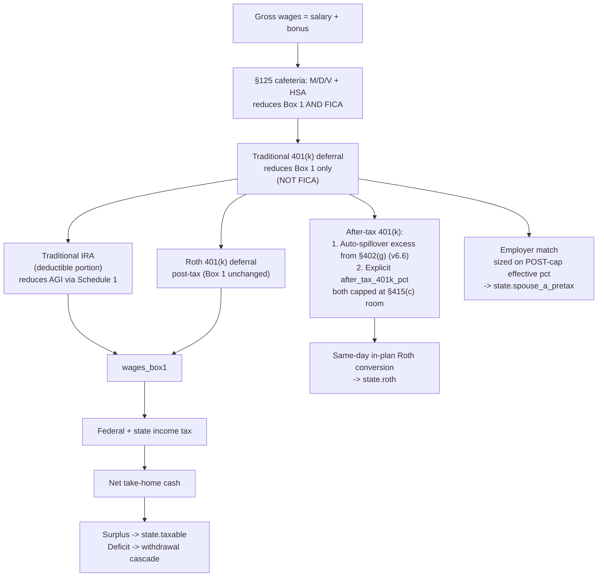

This is implemented in [`tax_optimizer/simulator.py`](../tax_optimizer/simulator.py)
roughly between contributions/spillover/mega-backdoor (~lines 215–330)
and `wages_box1` + FICA + SDI (~lines 445–490). Search for
`elective_deferral_cap(` and `fica_household(` to land on the right
spot.

### Tax pipeline (working-year)

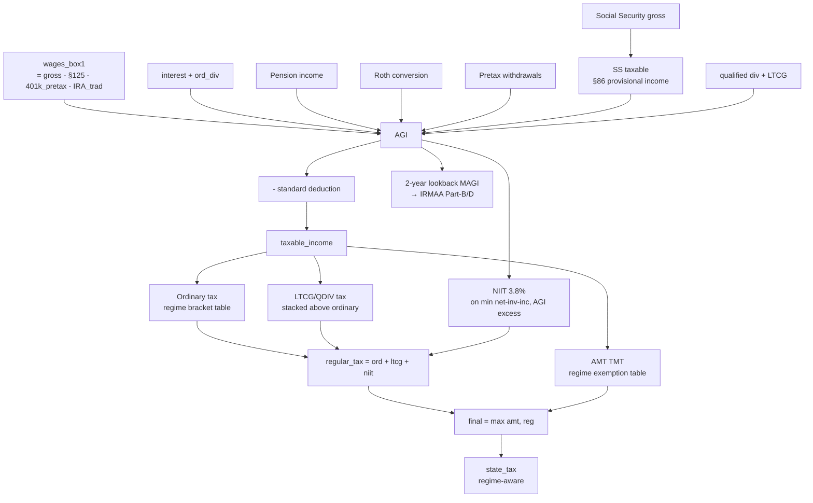

Implemented in [`tax_optimizer/tax/federal.py`](../tax_optimizer/tax/federal.py)
+ [`tax_optimizer/tax/state.py`](../tax_optimizer/tax/state.py) +
[`tax_optimizer/tax/irmaa.py`](../tax_optimizer/tax/irmaa.py). The
simulator threads the right inputs into each.

### Roth-conversion sizing (v6.5 liquidity guard)

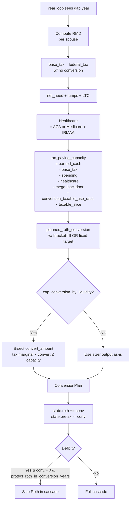

### Monte Carlo / optimizer relationship

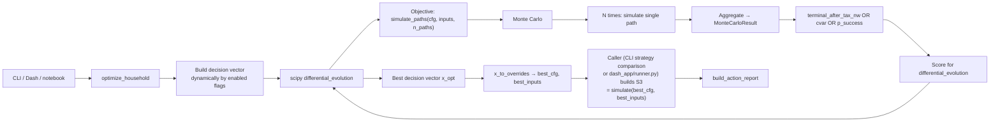

The optimizer is the most computationally expensive entry point —
`simulate()` runs `n_paths × n_iterations × pop_size` times. Tune via
the `maxiter`, `popsize`, and `n_paths` keyword arguments on
`optimize_household(...)`.

---

## 11. Conventions worth knowing

- **Frozen dataclasses for inputs, mutable `State` for runtime balances.**
  Don't mutate `Config` or `Inputs` in-place inside the simulator —
  use `dataclasses.replace`. The `State` object is the one designated
  mutable cell.
- **Stateless primitives, stateful simulator.** Every module in section
  4 above is either pure functions or near-pure (the `MarketModel`
  classes hold a sampling RNG but no scenario state). The simulator
  is the only "knows about the year loop" piece.
- **One-shot latches for one-time events.** Pension and annuity
  lump-sum gates use `state.pension_lump_sum_done` /
  `state.annuity_lump_sum_done` flags so the gate fires at most once
  per simulation, even if the household crosses `start_age` in a
  multi-year retiree scenario. The same latch *also* prevents the
  monthly-annuity initializer from re-creating a contract that was
  cashed out.
- **Diagnostic columns ride free.** Adding a new diagnostic (e.g.
  `annuity_taxable`, `pension_lump_sum_event`, `mega_backdoor_spillover_a`)
  just appends to the `rows.append({...})` dict. Backward-compatible
  — old consumers just don't read the new column.
- **Drift tests enforce the JSON template.** Any new `Config` or
  `Inputs` field MUST be mirrored into [`scenarios/template.json`](../scenarios/template.json) or
  [`tests/test_scenario_template.py`](../tests/test_scenario_template.py) will fail loudly. Same for nested dataclasses
  like `HealthPremiums` and `AnnuityInputs` (the parametrize list in
  the drift test must include them).
- **`Inputs.__post_init__` is the validation funnel.** Cross-field
  invariants (the `non_qualified` + `rollover_pretax` ban, valid
  `lump_sum_mode` values, positive `expected_payout_years`, the
  `household_kind` literal) live here so misconfigurations fail at
  construction time, not deep inside the simulator.
- **CHANGELOG is the migration log.** Every behavior change (including
  silent defaults flipping) gets a `[Unreleased]` entry with the
  knob that brings the legacy behavior back.
- **Dash never re-implements simulator logic.** The Dash app is a
  view layer — every dollar amount it shows comes from a
  `tax_optimizer.simulate(...)` DataFrame, never from
  `dash_app/*.py` math. The Dash modules are free to coerce, group,
  or re-aggregate the simulator's output for display, but they don't
  add new financial behavior.

---

## 12. Further reading

- [`docs/modeling_guide.md`](modeling_guide.md) — the end-to-end
  task-oriented "how do I model X" guide. Read this first if you're
  new to the package.
- [`docs/scenario_guide.md`](scenario_guide.md) — exhaustive JSON
  scenario reference (all knobs, every nested block, polymorphic
  forms)
- [`docs/dashboard.md`](dashboard.md) — user-facing walkthrough of the
  Plotly Dash UI: install, launch, six results tabs, common workflows,
  troubleshooting.
- [`docs/annuity_guide.md`](annuity_guide.md) — end-user guide for the
  annuity account type and pension/annuity `lump_sum_mode` knob: how
  to configure it from Dash, scenario JSON, and the CLI / Python API.
- [`docs/roth_conversion.md`](roth_conversion.md) — mechanism-focused
  deep dive on Roth conversion sizing, the v6.5 liquidity guard, and
  every knob that shapes the year-by-year conversion plan.
- [`docs/market_models.md`](market_models.md) — deep dive on the four
  `MarketModel` implementations and CMA preset selection.
- [`docs/references.md`](references.md) — citation traceability map
  pinning every modeling assumption (federal / state tax, annuity,
  RMD, IRMAA, ACA, payroll) to its IRC section, regulation, or IRS
  publication. Also contains the per-finding citation map for the
  open audit items.
- [`scenarios/README.md`](../scenarios/README.md) — top-level scenario
  directory README covering Roth-conversion + withdrawal knobs, §125
  health premiums, mega-backdoor auto-spillover, and the example
  scenarios (single, annuity-non-qualified, pension-lump-sum).
- [`CHANGELOG.md`](../CHANGELOG.md) — every behavior-affecting change,
  most recent first.
- [`README.md`](../README.md) — top-level repo overview + CLI usage.
