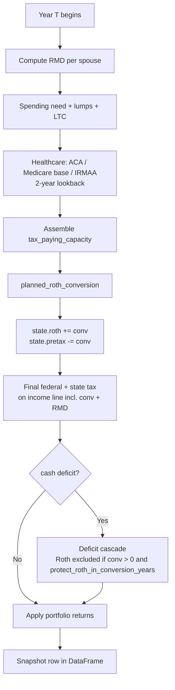

# Roth conversions — how the package sizes, gates, and protects them

A deep dive on how `tax_optimizer` plans pretax → Roth conversions every
year: the two sizing modes, the v6.5 **liquidity guard** that prevents
silent Roth-raids, the v6.5 **Roth protection** in the deficit cascade,
how the household's `tax_paying_capacity` is built, and every knob you
can turn.

**Companion documents:**

- [`scenarios/README.md` § Roth conversion & withdrawal knobs](../scenarios/README.md#roth-conversion--withdrawal-knobs)
  — JSON syntax reference for every knob, defaults, defensible ranges
- [`docs/architecture.md` § conversion.py](architecture.md#tax_optimizerconversionpy--planned_roth_conversion)
  — where conversion sits in the year loop
- [`tax_optimizer/conversion.py`](../tax_optimizer/conversion.py)
  — the source (single function, ~250 lines)

---

## 1. What a Roth conversion is, in this simulator

A **per-year, pretax → Roth dollar transfer**. The household elects to
recognize `conv` dollars of pretax balance as **ordinary income this
year**, pay the marginal federal + state tax on it, and land the same
`conv` dollars in the Roth bucket where future growth and withdrawals
are tax-free.

The simulator runs the conversion **once per year**, between the RMD
computation and the final tax line:



This ordering is fragile but deliberate. Everything from "spending need"
through "healthcare" is hoisted **before** the conversion sizer because
the sizer needs to know what cash is already committed before it can
decide how much tax the household can afford to pay on a conversion.

---

## 2. Two sizing modes (pick exactly one)

The simulator supports two conversion strategies. The knobs are
mutually exclusive — exactly one is positive in a given scenario.

### Mode A — Fixed-amount

> `cfg.roth_conversion_amount` (float, default `0.0`)

When `> 0`: convert exactly that many dollars per year, capped at the
available pretax balance net of RMD. Gated to the
**retirement-to-RMD window per spouse**:

```python
a_eligible = (
    state.spouse_a_age >= inputs.spouse_a_retire_age
    and state.spouse_a_age < cfg.rmd_start_age
)
```

The gap-only gate exists because firing a fixed `$40k/yr` conversion on
top of working-year W-2 wages is almost never what a user wants — they'd
just be paying their working-year marginal rate on top of already-high
income. If you genuinely want pre-retirement conversions, switch to
**bracket-fill** (which self-regulates to zero in those years anyway).

**Use this mode when:** you've already done the bracket-arithmetic
yourself and just want the simulator to execute a specific dollar
schedule. Or for backward compatibility with old scenarios written
before bracket-fill existed.

### Mode B — Bracket-fill *(recommended)*

> `cfg.roth_conversion_target_bracket` (float, default `0.0`)

When `> 0` (e.g. `0.22` or `0.24`): convert just enough to push the
year's taxable income up to (but not past) the top of that ordinary
bracket. Sizer logic:

1. Fold the year's RMD into the income line first (IRS requires RMD
   before conversion)
2. Compute `taxable_income` with RMD but no conversion
3. Call `amount_to_fill_bracket(ti, target_bracket, brackets)` to get
   remaining headroom under the target ceiling
4. `total = min(headroom, available pretax balance net of RMD)`

This is **self-regulating across the lifecycle**:

| Year type | `taxable_income` before conv | Bracket headroom | Conv fires? |
|---|---|---|---|
| Working year, target = 22% | already in 24%/32% | 0 | No |
| Gap year (retired, pre-RMD), target = 22% | low (just SS / pension) | large | Yes, big |
| Post-RMD year, target = 22% | RMD already pushes into bracket | small | Yes, small |
| Widow year, single filer, target = 22% | brackets compressed | depends | Often smaller |

Because of this auto-regulation, the eligibility gate in bracket-fill
mode is just `state.pretax > 0` — opened wider than fixed mode.

**Use this mode when:** you want the simulator to manage the
year-by-year sizing itself based on bracket headroom. This is the
default recommendation, and it's also the axis the **optimizer**
searches directly (its `conv_bracket_idx` decision dimension picks a
value from a discrete `BRACKET_CHOICES` grid and writes it into
`cfg.roth_conversion_target_bracket` for each candidate run — see
[`tax_optimizer/optimizer.py`](../tax_optimizer/optimizer.py) `_build_decision_vector_meta`).

> **Don't confuse this with `cfg.bracket_fill_target`.** That's a
> separate knob that controls the `bracket_fill` *withdrawal* strategy
> (caps **pretax withdrawals** at a bracket ceiling), not the
> conversion sizer. See § 7 below for how the two interact.

### Per-spouse split

Once `total` is known, it's split **pro-rata by pretax balance**:

```python
a_share = a_avail / cap        # a_avail = max(0, spouse_a_pretax - rmd_a)
conv_a = total * a_share
conv_b = total - conv_a
```

So a spouse with a $1.2M pretax balance and a spouse with a $300k
pretax balance split a $50k conversion as ~$40k / ~$10k. Both spouses
must be eligible (retirement age + alive) for their pretax to count.

### What happens if both knobs are zero

Sizer returns `(0.0, 0.0)` immediately. No conversion this year. This is
the default state — you have to opt in.

---

## 3. The liquidity guard (v6.5)

The single most important piece of the conversion logic, because it
fixes a strategy-defeating bug from pre-v6.5: aggressive
`roth_conversion_target_bracket` settings used to convert into bracket
headroom the household couldn't actually pay tax on, and the deficit
cascade would silently raid the just-converted Roth bucket — under
IRS rules potentially triggering a 10% penalty on conversion principal
if the holder was < 59½ or the 5-year clock hadn't matured.

### The two knobs

> `cfg.cap_conversion_by_liquidity: bool = True`
> `cfg.conversion_taxable_use_ratio: float = 0.5`

When `cap_conversion_by_liquidity = True`, the sizer **bisects** the
conversion amount down until the marginal federal + state tax delta
fits inside `tax_paying_capacity`.

### How `tax_paying_capacity` is built

The simulator assembles it at lines ~792–842 of `simulator.py`,
**before** calling the conversion sizer:

```
tax_paying_capacity = max(0, guaranteed_cash_no_conv - committed_obligations)
                   + state.taxable * conversion_taxable_use_ratio
```

Where:

```
guaranteed_cash_no_conv = earned_cash  + pension + ssn + rmd_total
   (working years)      = wages_box1 + interest + qdiv + ltcg
                          - FICA - SDI
   (retired)            = 0

committed_obligations  = base_tax_no_conv         # fed + state tax on income + RMD
                       + net_need                 # spending after HSA pay-down
                       + medicare_base_premium
                       + health_pre65
                       + irmaa_cost
                       + ira_total_outflow        # Trad IRA contrib + backdoor-Roth tax
                       + mega_backdoor_total      # after-tax 401(k) cash going to Roth
```

The intuition: *"How much cash does the household have left over after
paying for spending, healthcare, contributions, and base tax — that it
could redirect to the additional tax on a Roth conversion?"*

The `conversion_taxable_use_ratio` term is the **bridge between
portfolio and cash**. Default 0.5 means "I'm willing to spend up to
half my taxable brokerage on conversion tax". This is typically the
single knob to tune to make bracket-fill more or less aggressive
without touching the bracket target itself:

| `conversion_taxable_use_ratio` | Behavior |
|---|---|
| `0.0` | Most conservative. Conversion tax must come entirely from earned-income surplus / pension / SS / RMD net of expenses. Tiny conversions in pre-retirement gap years. |
| `0.5` (default) | Balanced. Half the taxable brokerage is in scope; the other half is preserved as runway for shocks. |
| `1.0` | Most aggressive. Willing to drain the entire taxable brokerage. Useful if you have an out-of-model cash reserve for emergencies. |

### The bisection

Once capacity is known, the sizer:

1. Computes the marginal tax delta `Δ(total)` of adding `total` to the
   income line (federal + state, both via `_marginal_tax_on(conv)`)
2. If `Δ(total) ≤ tax_paying_capacity`, no truncation — use `total`
3. Otherwise, **bisect** on `conv ∈ [0, total]` for up to 40 iterations
   or until `hi - lo < $100`, picking the largest `conv` whose
   marginal tax delta still fits capacity
4. Set `capped_by_liquidity = True` on the returned `ConversionPlan`

The marginal tax delta is computed inclusive of:

- Ordinary-bracket creep (more conversion → higher marginal rate)
- NIIT (3.8% on the lesser of net-investment-income vs MAGI excess
  over $250k MFJ / $200k single)
- AMT (whenever TMT > regular tax)
- Social Security taxation ramp (under §86 provisional income)
- State income tax (via `state_tax_fn` when supplied, which it always
  is from `simulator.py`)
- IRMAA is **excluded** from the marginal calc — it operates on a
  2-year lookback (`cfg.irmaa_lookback_years=2`), so this year's
  conversion doesn't push this year's IRMAA. It *will* push IRMAA two
  years later, which surfaces in `irmaa_cost` for that future year.

### Worked example — when the guard kicks in

Suppose a 64-year-old MFJ household, both retired:

- Income line before conversion: $40k SS taxable + $20k QDIV = $60k AGI
- Standard deduction $30k → taxable_income $30k → in the 12% bracket
- `roth_conversion_target_bracket = 0.24` → headroom to top of 24% ≈ $174k
- Available pretax balance: $800k → `total = $174k` after Mode B
- Marginal tax on $174k of conv at this income level: ~22%/24% blended
  + 9% CA state = ~$57k federal+state delta

Now capacity:

- `earned_cash = 0` (retired)
- `pension + ssn + rmd_total = $40k` (SS) `+ $0 + $0 = $40k`
- `committed_obligations ≈ $5k (base tax on $30k TI) + $80k spending`
  `+ $5k Medicare/health + $0 IRMAA + $0 contribs = $90k`
- `cash_surplus = max(0, $40k - $90k) = $0`
- `taxable_slice = $400k × 0.5 = $200k`
- `tax_paying_capacity = $0 + $200k = $200k`

Outcome: `Δ($174k) = $57k ≤ $200k` → **no truncation**. The whole 24%
bracket is filled. `roth_conv_capped_by_liquidity = False`,
`roth_conv_bracket_target = $174k`, `roth_conversion = $174k`.

But change one variable: drop `conversion_taxable_use_ratio` to `0.1`:

- `taxable_slice = $400k × 0.1 = $40k`
- `tax_paying_capacity = $0 + $40k = $40k`
- `Δ($174k) = $57k > $40k` → **bisect**
- Bisection lands on `conv ≈ $115k` (marginal tax there ≈ $40k)
- `roth_conv_capped_by_liquidity = True`,
  `roth_conv_bracket_target = $174k`,
  `roth_conversion = ~$115k`

The diagnostic columns make the truncation visible — see § 6.

---

## 4. Roth protection in the deficit cascade (v6.5)

After the conversion fires, the simulator computes final tax and runs
`cover_deficit()` if there's still a cash shortfall. The default
cascade order is **taxable → Roth → HSA → pretax**.

> `cfg.protect_roth_in_conversion_years: bool = True`

When this is `True`, **Roth is excluded from the cascade in any year
`roth_conversion > 0`**:

```python
roth_cascade_ok = not (
    conv > 0 and cfg.protect_roth_in_conversion_years
)
```

Why this exists even with the liquidity guard:

- The bisection runs in `$100` increments and stops at 40 iterations,
  so there can be small residuals
- The marginal-rate function is **non-monotonic** at AMT/NIIT/SS
  taxation phase-in boundaries, so the bisection's monotonicity
  assumption can be off by a few hundred dollars in those years
- Spending shocks (LTC, lumps) can push the post-conversion deficit
  beyond what was modeled in the capacity formula

Without protection, those residuals would silently raid the
just-converted Roth — which under IRS rules can trigger a 10%
**penalty on conversion principal** if the holder is < 59½ or the
5-year clock hasn't matured. The model doesn't track ages < 59½ or
the 5-year clock, so it can't warn you about the penalty — it just
*always* protects.

With protection on, any residual surfaces as `unfunded` in the
DataFrame, a loud diagnostic the action report flags. You can then:

- Increase `conversion_taxable_use_ratio` to give the guard more room
- Lower `roth_conversion_target_bracket` by one bracket
- Accept the small `unfunded` as model noise (typical: ≤ 1% of
  spending need)

Set to `False` only if you want pre-v6.5 behavior, e.g. for stress
tests like "what if I had a cash reserve outside the model".

---

## 5. RMD interaction (TC-7 fix)

The conversion's per-spouse cap **reserves each spouse's RMD against
their own pretax balance**:

```python
a_avail = max(0.0, state.spouse_a_pretax - rmd_a) if a_eligible else 0.0
b_avail = max(0.0, state.spouse_b_pretax - rmd_b) if b_eligible else 0.0
cap = a_avail + b_avail
```

So a $80k/yr fixed conversion against $100k of pretax + $30k RMD
converts at most $70k — the RMD always takes its share first.

Bracket-fill mode also folds RMD into the **income line** before
measuring headroom (lines 155–173 of `conversion.py`). Without this,
the simulator would convert into bracket space the RMD is about to
consume, then pay higher marginal rates on the RMD itself — silent
strategy-degrading bug pre-TC-7.

---

## 6. Diagnostic columns

Every row of the simulation DataFrame carries five columns specific to
the conversion. Read them with `df.loc[df["roth_conversion"] > 0, [...]]`
to audit a strategy.

| Column | Meaning | What to look for |
|---|---|---|
| `roth_conversion` | Total converted this year (combined household) | The headline number |
| `roth_conversion_a` / `roth_conversion_b` | Per-spouse conversion | Verify pro-rata split looks sane |
| `roth_conv_capped_by_liquidity` | `True` iff the liquidity guard bisected the conversion below the sizer's target | Smoking gun for "wanted more, ran out of cash" |
| `roth_conv_bracket_target` | What the sizer *would* have converted absent the liquidity guard | Compare against `roth_conversion` to quantify truncation |
| `roth_conv_tax_capacity` | The `tax_paying_capacity` value passed to the sizer | Investigate years where it's surprisingly low or zero |
| `unfunded` *(not conversion-specific but relevant)* | Residual deficit the cascade couldn't cover | Non-zero in a conversion year strongly suggests the guard could be tighter or `conversion_taxable_use_ratio` too low |

A typical audit query:

```python
# Where did the liquidity guard kick in?
df.loc[df["roth_conv_capped_by_liquidity"], [
    "year",
    "roth_conversion",
    "roth_conv_bracket_target",
    "roth_conv_tax_capacity",
    "agi",
    "unfunded",
]]
```

If `roth_conv_bracket_target - roth_conversion > 0` and `unfunded ≈ 0`,
the guard worked: it truncated to keep the household solvent. If
`unfunded > 0` in the same year, the model is telling you that even
after truncating, the household couldn't fund the conversion's tax
without protection — try raising `conversion_taxable_use_ratio`.

---

## 7. Related knobs that *indirectly* shape conversions

These don't appear in the conversion sizer but materially change what
it can do.

| Knob | Effect on conversions |
|---|---|
| `cfg.rmd_start_age` (default `75`) | Upper edge of the fixed-mode gap window. Also when RMDs start eating bracket-fill headroom — later `rmd_start_age` extends both windows. |
| `inputs.spouse_a_retire_age` / `spouse_b_retire_age` | Lower edge of the fixed-mode gap window per spouse. Earlier retirement = longer gap = more conversion opportunities. |
| `cfg.withdrawal_strategy` + `cfg.bracket_fill_target` | A separate bracket ceiling — but for **withdrawals**, not conversions. When `withdrawal_strategy = "bracket_fill"`, pretax withdrawals during retirement are sized to fill `bracket_fill_target`. The two ceilings interact: a common pattern is to set both to the same value (e.g. 22%), so the household runs a coordinated "fill 22% with conversions before RMD age, then fill 22% with withdrawals after". See § 9 recipes and [`scenarios/README.md § withdrawal-strategy knobs`](../scenarios/README.md#b-withdrawal-strategy-config). |
| `cfg.irmaa_lookback_years` (default `2`) | With lookback=2, this year's conversion doesn't trigger this year's IRMAA — the surcharge ripples 2 years forward. With lookback=0 the conversion's MAGI bump shows up immediately, shrinking `tax_paying_capacity` and forcing the guard to bisect more often. |
| `cfg.regime_change_year_offset` / `regime_change_target` (TCJA sunset) | Bracket boundaries shift mid-simulation. Bracket-fill mode auto-adapts; fixed-amount mode doesn't. |
| `cfg.state_regime` | Higher-tax states (CA/NY) make every conversion cost more marginal tax → capacity fills faster → smaller conversions under the guard. |
| `cfg.bracket_indexing_rate` | Slower bracket indexing pulls more income into higher brackets over time, shrinking bracket-fill headroom. |
| `cfg.heir_marginal_rate` | Not a conversion knob, but the **objective** the optimizer is trying to beat. A higher heir rate makes the math favor more aggressive conversion (more pretax → more deferred tax liability that's better cleared today). |

---

## 8. End-to-end worked example

A canonical bracket-fill case study. Assume default v6.5 settings:

```yaml
spouse_a_retire_age: 60
spouse_b_retire_age: 60
rmd_start_age: 75
roth_conversion_target_bracket: 0.24
cap_conversion_by_liquidity: true
conversion_taxable_use_ratio: 0.5
protect_roth_in_conversion_years: true
state_regime: CA
```

The household at age 63, MFJ, both retired:

- $1.6M pretax, $200k Roth, $500k taxable, $80k HSA
- $35k SS (combined, claimed at 62), no pension
- Spending need $90k, healthcare $8k (pre-Medicare)

**Year T sequence:**

1. RMD: $0 (both 63, pre-RMD).
2. Spending: net_need = $90k (no HSA pay-down — pre-65).
3. Healthcare: $8k pre-65, no Medicare, no IRMAA.
4. **Capacity:**
   - `guaranteed_cash_no_conv = 0 (no wages) + 0 (no pension) + $35k SS + 0 RMD = $35k`
   - `base_tax_no_conv` on $35k SS + $0 conv ≈ $0 (SS under filing threshold)
   - `committed = $0 tax + $90k spending + $8k healthcare = $98k`
   - `cash_surplus = max(0, $35k - $98k) = $0`
   - `taxable_slice = $500k × 0.5 = $250k`
   - `tax_paying_capacity = $0 + $250k = $250k`
5. **Sizer (Mode B, 24% target):**
   - taxable_income before conv: ~$0 (SS not yet taxable at this level)
   - Headroom to top of 24% bracket MFJ 2026: ~$390k
   - Pretax cap: $1.6M
   - `total = min($390k, $1.6M) = $390k` (target)
6. **Liquidity guard:**
   - Marginal fed+CA tax on $390k of conv: ~$95k federal, ~$30k CA = $125k
   - `$125k ≤ $250k capacity` → no truncation
   - `total = $390k`, `capped_by_liquidity = False`
7. **Apply:** `conv_a = $390k × (a_avail/cap) ≈ $293k`, `conv_b ≈ $97k`
   (assuming 75/25 pretax split). `state.pretax -= $390k`,
   `state.roth += $390k`.
8. Final tax bill: $125k (matches the marginal estimate within bisection precision).
9. **Deficit check:** household needs $90k spending + $8k healthcare +
   $125k tax = $223k of cash. Has $35k SS + $250k taxable available =
   $285k. Surplus $62k → no cascade fires.
10. Snapshot: `roth_conversion = $390k`, `roth_conv_capped_by_liquidity = False`,
    `roth_conv_bracket_target = $390k`, `roth_conv_tax_capacity = $250k`,
    `unfunded = 0`.

**Now drop `conversion_taxable_use_ratio` to `0.2`:** capacity becomes
`$500k × 0.2 = $100k`, the bisection truncates to `conv ≈ $310k` (where
marginal tax ≈ $100k), `roth_conv_capped_by_liquidity = True`,
`roth_conv_bracket_target = $390k`, `roth_conversion ≈ $310k`. The
diagnostic columns now flag the truncation.

**Now also turn off Roth protection** (`protect_roth_in_conversion_years = False`):
in the truncated case above, if there's any residual deficit, the
cascade is free to take it from the just-converted Roth. The
`unfunded` column drops to 0, but you've now silently undone part of
the conversion strategy. Always keep this on.

---

## 9. Common recipes

### "I want bracket-fill conversions, conservatively"

```json
{
  "config": {
    "roth_conversion_target_bracket": 0.22,
    "cap_conversion_by_liquidity": true,
    "conversion_taxable_use_ratio": 0.3,
    "protect_roth_in_conversion_years": true
  }
}
```

22% ceiling, only 30% of taxable in scope for conversion tax. Smaller
conversions, more taxable runway preserved.

### "I want bracket-fill conversions, aggressively"

```json
{
  "config": {
    "roth_conversion_target_bracket": 0.24,
    "cap_conversion_by_liquidity": true,
    "conversion_taxable_use_ratio": 0.75,
    "protect_roth_in_conversion_years": true
  }
}
```

24% ceiling, up to 75% of taxable allowed. The guard still prevents
the model from silently raiding the Roth, but the bigger taxable slice
in capacity means the bisection rarely fires.

### "Convert exactly $40k/yr during the gap"

```json
{
  "config": {
    "roth_conversion_amount": 40000,
    "roth_conversion_target_bracket": 0.0,
    "cap_conversion_by_liquidity": true,
    "conversion_taxable_use_ratio": 0.5
  }
}
```

Mode A. Fires only between `retire_age` and `rmd_start_age` per
spouse. Liquidity guard still applies (will truncate below $40k if
the household genuinely can't afford the tax).

### "Stress-test the pre-v6.5 behavior"

```json
{
  "config": {
    "roth_conversion_target_bracket": 0.24,
    "cap_conversion_by_liquidity": false,
    "protect_roth_in_conversion_years": false
  }
}
```

Both guards off. The sizer fills the bracket regardless of cash, and
the cascade is free to take from Roth. Useful as a sensitivity check:
the gap between this and the default-on case is the dollar value the
v6.5 guards added.

### "Let the optimizer decide the bracket"

Don't set `roth_conversion_target_bracket` at all. The optimizer's
decision vector includes a `conv_bracket_idx` axis that picks a value
directly from `BRACKET_CHOICES` (a discrete grid of bracket rates) and
writes it into `cfg.roth_conversion_target_bracket` for each candidate
run; whichever value scores best on the configured objective
(`terminal_nw` / `cvar` / `p_success`) wins.

### "Coordinate conversions with bracket-fill withdrawals"

Set both ceilings to the same bracket — the household fills it with
conversions during the gap years and with withdrawals after RMD age:

```json
{
  "config": {
    "roth_conversion_target_bracket": 0.22,
    "withdrawal_strategy": "bracket_fill",
    "bracket_fill_target": 0.22,
    "cap_conversion_by_liquidity": true,
    "conversion_taxable_use_ratio": 0.5,
    "protect_roth_in_conversion_years": true
  }
}
```

Note these are **two separate knobs** — `roth_conversion_target_bracket`
caps conversions, `bracket_fill_target` caps withdrawals when the
withdrawal strategy is `"bracket_fill"`. Setting only one of them leaves
the other side of the strategy ungoverned.

---

## 10. TL;DR — the seven knobs that matter

| Knob | Default | What it does |
|---|---|---|
| `roth_conversion_amount` | `0.0` | Fixed-dollar mode. Set this OR the next, not both. Gap-window-only. |
| `roth_conversion_target_bracket` | `0.0` | Bracket-fill mode (e.g. `0.22`, `0.24`). Self-regulating across the lifecycle. The recommended mode. The optimizer searches this directly via its `conv_bracket_idx` axis. |
| `cap_conversion_by_liquidity` | `True` | Master switch for the v6.5 liquidity guard. Keep `True` unless explicitly modeling "infinite outside tax cash". |
| `conversion_taxable_use_ratio` | `0.5` | How much of taxable brokerage is in scope for conversion tax. **The main aggressiveness dial.** |
| `protect_roth_in_conversion_years` | `True` | Excludes Roth from the deficit cascade in any year a conversion fires. Keep `True`. |
| `rmd_start_age` | `75` | Upper edge of the fixed-mode gap window; also when RMDs start eating bracket-fill headroom. |
| `bracket_fill_target` *(adjacent, not a conversion knob)* | `0.22` | Bracket ceiling for the `bracket_fill` **withdrawal** strategy. Independent from `roth_conversion_target_bracket`. Listed here only because users often want them coordinated to the same bracket — see "Coordinate conversions with bracket-fill withdrawals" recipe in § 9. |

Mental model:

- **`roth_conversion_target_bracket`** sets the *ceiling*
- **`conversion_taxable_use_ratio`** sets the *willingness to fund it*
- **the liquidity guard** enforces that the model never converts beyond
  what the household can actually pay tax on without raiding the Roth
- **Roth protection** is the safety net under the safety net — the cascade
  refuses to touch just-converted dollars, leaving any residual visible
  in `unfunded`

The other knobs are guardrails and mode selectors.

---

## 11. Source map

If you want to read the actual code that implements this:

| What | Where |
|---|---|
| Sizing logic (modes A and B, RMD reservation, pro-rata split) | [`tax_optimizer/conversion.py`](../tax_optimizer/conversion.py) — single function, ~250 lines |
| Liquidity-guard bisection | [`tax_optimizer/conversion.py`](../tax_optimizer/conversion.py) lines 183–234 |
| `tax_paying_capacity` assembly | [`tax_optimizer/simulator.py`](../tax_optimizer/simulator.py) lines ~792–842 |
| Roth-cascade exclusion in conversion years | [`tax_optimizer/simulator.py`](../tax_optimizer/simulator.py) lines ~1055–1083 |
| `amount_to_fill_bracket` (bracket-headroom math) | [`tax_optimizer/tax/federal.py`](../tax_optimizer/tax/federal.py) |
| Diagnostic-column emission | [`tax_optimizer/simulator.py`](../tax_optimizer/simulator.py) `rows.append({...})` block (search for `roth_conversion`) |
| Knob declarations + docstrings | [`tax_optimizer/config.py`](../tax_optimizer/config.py) lines 79–122 |
| JSON syntax / template entry | [`scenarios/template.json`](../scenarios/template.json) under `"config"` |
| Regression coverage | [`tests/test_conversion_liquidity_v65.py`](../tests/test_conversion_liquidity_v65.py) |
